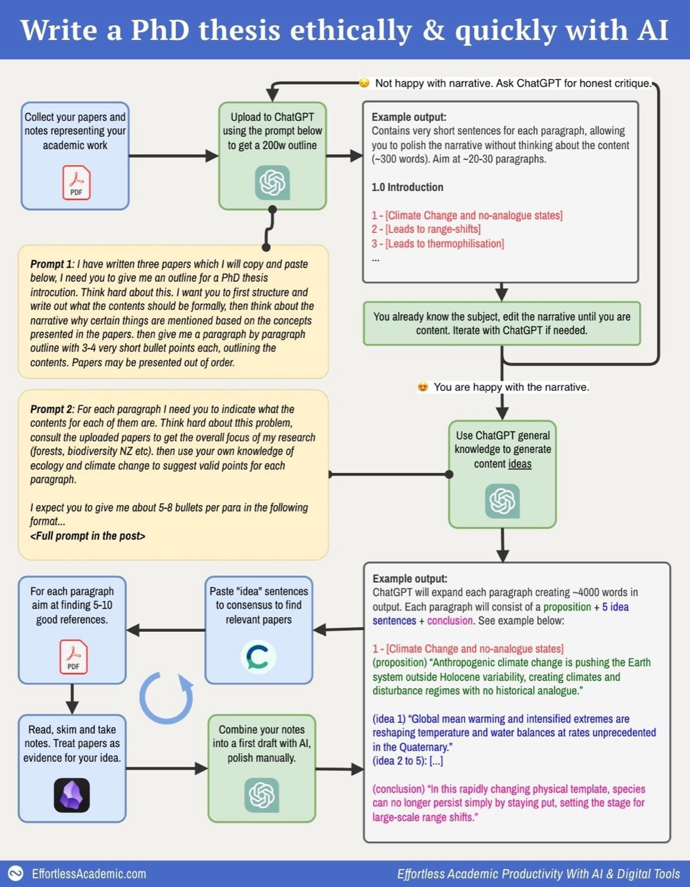
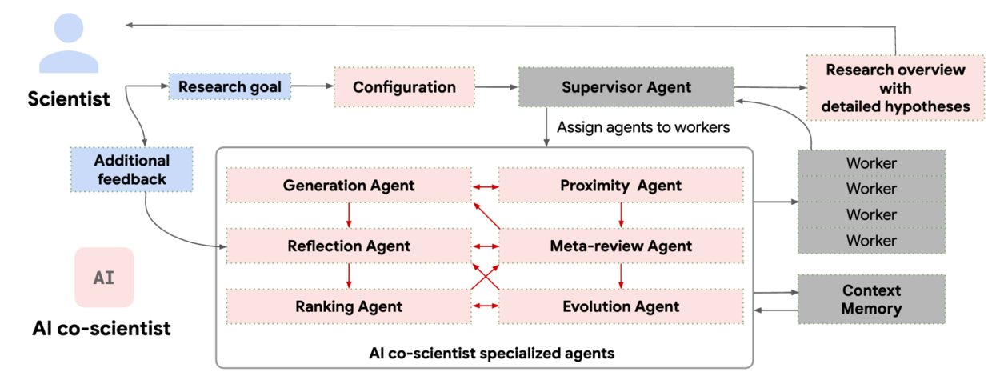

# Epistemic Voids #1: Citation Theater

## When papers become props

## The Post

A post went viral on X yesterday (4M views). By the time I came across it, the replies had already turned: gratitude curdling into skepticism, a thread from someone's supervisor that stopped mid-thought.

"I wrote 4,000 words of my thesis in one afternoon."

Then the author deleted it. But not before the workflow diagram had been saved and shared. Here's what it said:

> I wrote 4,000 words of my thesis in one afternoon—
>
> Here is how, and my two magic prompts (yes, it's ethical!):
>
> **1: Gather anything you've written**
> → Upload your old papers, drafts, or research notes.
> → If you have nothing, upload someone else's paper in your field.
> → Worst case: write a rough outline of what you think your thesis will be.
>
> **2: Get your narrative down**
> → Ask ChatGPT to write one five-word sentence per paragraph.
> → These are placeholders that summarize each paragraph.
> → Rearrange and tweak these sentences until the whole narrative makes sense start to finish.
> → You control the narrative — not the AI.
>
> **3: Expand each sentence into a series of ideas**
> → Use ChatGPT to turn each sentence into a paragraph outline using this structure:
>   → 1 topic sentence
>   → 2–4 supporting ideas
>   → 1 conclusion sentence
> → These are just general ideas, unless your topic is very niche, it will work beautifully.
> → This gives you a blueprint that's self-contained and logically tight.
>
> **4: Add real research**
> → Feed each idea sentence into Consensus.
> → Tool easily finds 10 good papers per paragraph.
> → Skim/read them and pull key facts.
> → Aim to condense them into atomic sentences like this: "Smoking causes cancer" (Smith, 2020).
> → Now you have a set of real, reference-backed notes.
>
> **5: Draft the real paragraphs**
> → Feed those factual notes into ChatGPT.
> → Generate a clean, referenced academic paragraph.
> → Repeat this for every paragraph.
> → Now you've got a full first draft that is structured, sourced, and readable.
>
> This process kills blank-page anxiety. It lets you see the full story before you write a single real paragraph. You're not guessing anymore. You're building.
>
> **Is this ethical?**
> I think yes, because AI only helps me organise and express my ideas. I control the narrative and decide what to say - AI just helps me say it clearly. It transforms my papers, notes, and outlines into what is accepted as academic writing. Every step is fact-checked, and the final output is still 100% my intellectual work.

At first glance, it looks like someone finally cracked the chaos of thesis writing. Boxes, arrows, steps.

Look closer.

---

## The Inversion

I read the diagram three times. Two phrases stood out:

"Use ChatGPT **general knowledge** to generate content **ideas**."

"Treat papers as **evidence for your idea**."

What would it mean to generate ideas first, then shop for evidence?

The actual claims that will form the thesis originate from ChatGPT's general knowledge—a statistical average of everything the model has ever read on the topic. No deep reading. No wrestling with contradictions in the literature.

Prompt 2 makes it explicit: "consult the uploaded papers to get the overall focus of my research... then use **your own knowledge** of ecology and climate change to suggest valid points for each paragraph."

The pipeline runs backwards:

> AI-generated claims → evidence search

not

> evidence → claims

The AI generates the ideas. The AI generates the structure. *Then* you hunt (with tools like Consensus and Elicit) for papers to "treat as evidence": papers retrofitted to support claims that arrived fully formed, like shopping for accessories after you've already chosen the outfit.

So when the author claims "100% my intellectual work," where is the intellectual work?

This inverts the sequence that actually produces understanding.

Claims come later. First: a phenomenon that intrigues you, reading that confuses you. Contradictions surface. Evidence conflicts. Wrestling follows. A position emerges, tentative but defensible, because you've seen what could tear it down.

The struggle feels like inefficiency. It's where knowing happens.

Here, papers aren't foundations. They're decorations.

The problem here, in my view, is claiming intellectual authority over work you didn't actually do.

This is **citation theater**. We've all seen it before—work that retrofitted citations to claims. This workflow automated the practice and sold it back as innovation.

---

## What's Missing

Run your finger down the five steps. Where does it ask you to look for trouble?

- What evidence would *challenge* this claim?
- What alternative explanations exist?
- Which papers *disagree* with each other?

Nowhere.

The architecture is entirely confirmatory. Disconfirming evidence stays invisible. The diagram does include a feedback loop: "Ask ChatGPT for honest critique." But look closer—it critiques the *narrative*, not the facts. Even the self-correction is about performance.

The seduction is that it *feels* diligent. Every paragraph has multiple references. You did open the PDFs. The bibliography is long. But you're performing the visible rituals of scholarship while outsourcing the real judgment to a model that has no stake in whether your claims survive scrutiny.

---

## The Business Behind the Advice

This wasn't a peer sharing their workflow. The author runs a business selling AI productivity courses to academics, tens of thousands of followers, and the viral post was marketing.

"100% my intellectual work" reads differently when it's a sales pitch. Researchers are being *targeted* by this kind of advice, framed as productivity tips, sold as courses.

The deletion becomes more significant. Even the seller reconsidered.

When productivity advice comes from someone with something to sell, the question shifts: who benefits from me believing this works?

---

## The Contrast

What if the architecture itself demanded rigor?

Google's [AI Co-Scientist](https://research.google/blog/accelerating-scientific-breakthroughs-with-an-ai-co-scientist/) is a multi-agent system built on Gemini 2.0. Same aesthetic as the viral thesis diagram: boxes, arrows, agents, and feedback loops.

Completely different epistemology.

The system uses a coalition of specialized agents inspired by the scientific method itself:

- **Generation Agent**: explores literature, runs *simulated scientific debates* to produce candidate hypotheses
- **Reflection Agent**: acts as critical peer reviewer, assesses plausibility, novelty, testability
- **Ranking Agent**: Elo-based tournaments where hypotheses compete head-to-head, weaknesses get surfaced
- **Evolution Agent**: iteratively improves top-ranked hypotheses, addresses limitations
- **Meta-review Agent**: synthesizes feedback, generates research overview

Generate → debate → rank → evolve → review. In a loop. The system argues with itself. Hypotheses that can't survive internal critique get eliminated before a human ever sees them.

Several scientists and the team at Google validated the system's outputs in actual laboratory experiments: drug repurposing candidates for acute myeloid leukemia, later confirmed by *in vitro* experiments. In another test, the AI independently rediscovered a mechanism researchers had found but hadn't yet published.

In interpretive research, "validation" looks different: negative case analysis, independent coding, and peer critique. The method varies. The principle doesn't. Claims get subjected to scrutiny that could prove them wrong or lacking.

The Co-Scientist makes AI earn its conclusions.

---

## The Hollow Middle

Put these side by side.

Deep human engagement with literature produces genuine understanding. You can defend your claims. You know the weak points.

Rigorous AI systems with adversarial review produce outputs that have survived internal critique. The AI has done real epistemic labor.

The viral workflow does neither. The human skims for confirmation. The AI generates without adversarial pressure. Nobody stress-tests anything.

Consider this: if we're doing epistemic cosplay anyway, we might as well let AI handle the whole thing. It would probably be more internally consistent. At least then we'd be honest about what we're doing.

Instead, this workflow gives you the worst of both worlds: you don't learn anything from wrestling with the literature, *and* the output isn't properly verified.

All the surface markers of rigor. None of the depth.

---

## The Question That Remains

Whatever tools we procure, the epistemic authority stays with us. No workflow, no AI, and no productivity course can outsource the core work of knowing. When papers become props, we've stopped doing that work.

The tools will keep getting better. The temptation to delegate will keep getting stronger. The sales pitches will keep getting more sophisticated.

But there's a question that surfaces at 2am, when the word count looks good but something feels off: *Do I actually know this, or did I just assemble it?*

That's the one prompt no AI can answer for you.

Maybe that's not a deficiency in the workflow. Maybe it's the whole point.

---

*This is the first in a series called **Epistemic Voids**: case studies in AI workflows that produce the aesthetic of rigor without the substance. More specimens to come.*

—Xule Lin
