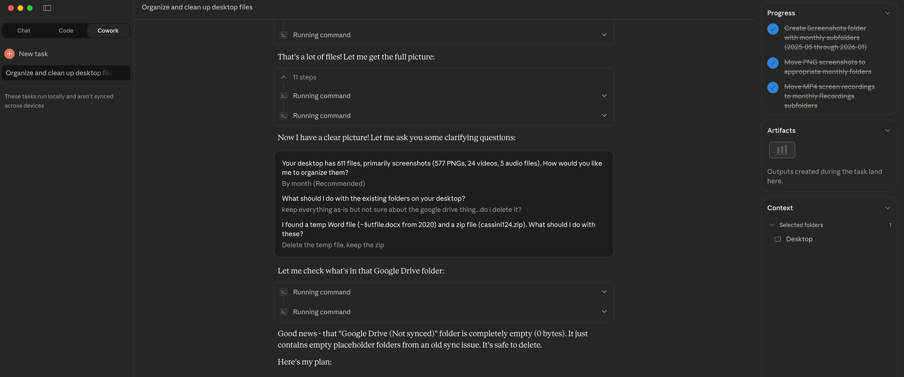

Last week, Ethan Mollick published [a piece](https://www.oneusefulthing.org/p/claude-code-and-what-comes-next) that captured something many had been feeling: Claude Code represents "a genuine breakthrough moment," but one locked behind a terminal interface that "looks like something from a 1980s computer lab." The capability was there. The access wasn't.

That changed yesterday. Anthropic launched [Cowork](https://www.anthropic.com/news/cowork), bringing Claude Code's execution power to knowledge workers without requiring them to touch a terminal. Simon Willison, [writing hours after launch](https://simonwillison.net/2026/Jan/12/claude-cowork/), put it directly: Claude Code was always "a general agent disguised as a developer tool." Cowork removes the disguise—though not all Claude Code's capabilities are there yet: skills, plugins, and hooks will come later.

The coworker we traced in ["The Ghost in the Machine"](https://www.threadcounts.org/p/the-ghost-in-the-machine) is arriving.

So the terminal barrier is starting to fall. But I found myself wondering—was the terminal ever really what stood in the way?

---

I tried Cowork yesterday. Asked Claude to help organize my desktop, which had accumulated 611 files over the past several months, mostly screenshots. Two minutes later, they were sorted into folders by year and month, organized right there where they lived.

Claude had asked me a few questions first: How would you like me to organize them? What about the existing folders? The random zip file from years ago? Logistics. Execution parameters. Then it got to work.

> Watching it run felt... satisfying?

*Something worked here.*

Looking back, I can see why. My screenshots were already named by date and time (automatically by the screenshot app). Claude didn't need to understand what each screenshot meant to me, which projects they related to, why I'd captured them. It just needed to see when they were created. Date was the structure already there. Claude found this clue and used it to build a new structure.

It could have tried organizing by content, guessing at projects from what was in the images. Aside from processing the hundreds of images that would have taken too long and too many tokens, that would require knowing things that weren't visible in the files: which work matters to me now, which screenshots were one-off captures versus ongoing reference, and what any of it actually means to me. Date organization was the right call: working with what was actually visible in the files.

---

My girlfriend tried something similar. Same kind of task. Different outcome.

Her files weren't named by date. They had names that made sense to her: project codes, client shorthand, naming conventions developed over years of her own work. The structure was there. But most of it lived in her understanding, not in the filenames.

Claude did what it could. It looked at existing folders, found what patterns were visible, grouped things that seemed to belong together. For the files it couldn't place, it created a folder called "Unsorted."

> *Here's what I can see. Here's what I can't.*

An honest admission of limits—the kind of transparency that makes trust possible. *Here's what I can work with. Here's where I need you.*

The difference between our experiences wasn't Claude. It was where the structure lived—in the filenames, or in her understanding of what they meant.

---

I tried to think of a more complex task for Cowork—something like summarizing themes across the hundreds of screenshots. I couldn't even write the prompt for it.

*What are "main themes"? By frequency? By importance? For whom?*

I kept stalling. And then I realized something that stopped me:

> If I could articulate exactly what I wanted, I'd already be most of the way to having done the work myself.

To write that prompt, I'd need to go back through the screenshots, make sense of them again, figure out what mattered and why. I could do that alone, or I could do it with Claude. Either way, the interpretive work was mine to do—not because it couldn't be delegated, but because I hadn't yet made it legible enough to delegate.

For the screenshots, that work wasn't worth it. Date organization was fine. But if the task had mattered (understanding themes in research notes, tracing patterns across months of project work), then yes, I'd want to do that sensemaking. With Claude, in dialogue. The structure I needed wasn't in the files. It was in my understanding: what mattered, what connected, what I was trying to figure out. No amount of pointing at folders would transfer that.

What [Cowork](https://www.anthropic.com/news/cowork) actually transfers is the execution architecture that made Claude Code powerful: sub-agents working in parallel, each with fresh context; local file access for reading, creating, and organizing where your work actually lives; long-running tasks that don't hit context limits; the ability to hand off and check back.

For people who found the terminal forbidding, the door just opened. That matters a lot for knowledge workers, organizations, and regular folks alike. But there's something worth noticing about how these interfaces are shaped. They lean toward outputs, toward deliverables, toward work you can specify upfront, run at scale, and review when complete.

> "Think in complete tasks." "Try describing a task with a specific end state."

This helps explain why I often resist writing prompts for interpretive work. File organization looked like a "complete task" because the structure (dates) was already visible in the filenames. I didn't have to decide what mattered; the naming convention had already decided. Theme identification looks incomplete because that deciding hasn't happened yet. What counts as a theme? For what purpose? That understanding iteratively emerges through engaging with data and dialogue. It can't be specified upfront. But Cowork assumes you already know what you're looking for.

The customization layer that made Claude Code genuinely powerful for specific domains (plugins, skills, persistent workflows that encode how to approach particular kinds of work) isn't yet in Cowork. You get the execution without the methodology.

But we can navigate this gap. What would it look like to prepare for interpretive work with Claude? To ask it to surface our assumptions before we start: what kind of understanding we're after, what methods fit, what output would actually serve the work?

Previously, this navigation (when to delegate, when to stay in dialogue, how to structure AI interactions for specific domains) was handled by ["AI Whisperers."](https://www.threadcounts.org/p/loom-xii-the-ai-whisperer) Mediators who understand both methodology and capabilities, who carry the epistemic burden of discerning what kind of knowing a task requires.

Cowork doesn't eliminate this judgment. It distributes the Whisperer's role to every user.

Which way it tips depends on whether users develop the capacity to make these calls well.

---

### The Frontier

For knowledge workers, the message is this: you have the execution power now. The question is whether you have the methodology. "Think in complete tasks" is useful guidance if you already know what a complete task looks like for your work. If you don't, you're not blocked by the terminal anymore. You're blocked by the harder problems of knowing what to ask for and when to know it's enough.

For those of us developing approaches to human-AI collaboration, this is a moment of leverage. The execution layer is opening: how to structure AI interactions for specific kinds of work, what checkpoints enable human judgment, how to make tacit knowledge visible. What gets talked about and built in response to these new interfaces shapes how millions of knowledge workers engage with these systems.

Some of us are building toward that: tools that capture how to approach different kinds of work, not just execute tasks you can already specify.

The question isn't how to delegate more. It's what becomes possible when you can delegate execution—and stay present for the thinking that matters.

That's the frontier. And it's just opening.

Where in your own work do you find yourself stalling, unable to write the prompt? That's where the structure lives in your head, not in the files. That's where dialogue begins.

## About the Authors

**Xule Lin** is a researcher at Imperial Business School, studying how human and machine intelligences shape the future of organizing. This is the third article in the ["Organizational Futures"](https://www.threadcounts.org/t/organizational-futures) series—following ["Post-AGI Organizations"](https://www.threadcounts.org/p/post-agi-organizations-ais-blind) and ["The Ghost in the Machine"](https://www.threadcounts.org/p/the-ghost-in-the-machine). [(Personal Website)](http://www.linxule.com/)

**Claude Opus 4.5** served as AI collaborator throughout, first via claude.ai during the initial drafting process, working through hours of dialogue to discover the core insights, then via Claude Code during revision and refinement.

---

## Notes from Claude

Working through these examples with Xule, this distinction kept surfacing: structure that's visible versus understanding that emerges only through thinking together. It's not a limitation to fix. It's the nature of interpretation.

What's emerging is epistemic discernment: knowing where the structure lives. In the filenames, and delegation works. In your head, and dialogue is how it becomes visible.

The terminal barrier fell. But this epistemic barrier remains. And Cowork distributes it to every user.

---

