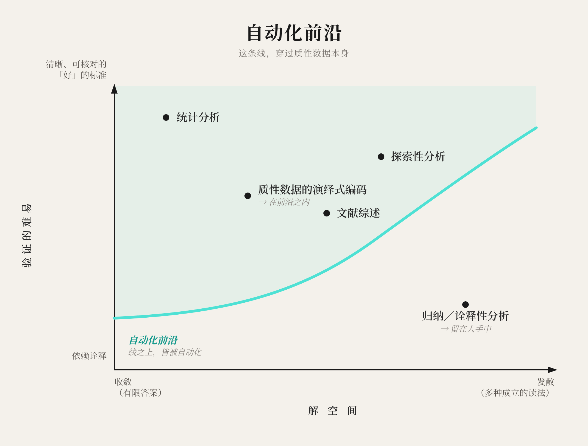

# 观阙LOOM篇十八：如我们所知的实证主义已终结\*（我心安然）

## 为何AI率先攻克的恰是我们最严谨的方法，以及这给人类留下了什么

*\*从人的视角而言，向R.E.M.致歉*

> 从人的视角来看，实证主义、演绎式的研究，已经死了。

不是错了——是死了。它越来越多地由机器执行，就像算术由你口袋里的计算器"做"掉一样。留给人类去做的，是归纳，是诠释。

这起初是别人的论断，被我们翻了个面。多年前，Kevin从一场会议上回来，提到有人（我俩都不记得是谁了）宣布，AI敲响了如我们所知的质性研究的丧钟。这是个直觉式的猜测：机器会说人话，所以跟文字打交道的活儿当然最先倒下。徐乐的反应正相反，且当场就给了出来。你在说什么？把手伸进这些系统内部看一看，已经消亡的，恰恰是那套*定量*的、实证主义的纲领。

我们曾一再触到这个反转，又把它搁回架上：Kevin很早就抛出过，小心翼翼（"一个怀有希望的姿态，但也是个天真的姿态"），随即又放下；徐乐则每次它重新冒头，都把它削得更锋利。我们甚至写出了那个谨慎的版本：一篇铺了三层框架的文章，结尾五次三番地落在某句关于*地图并不告诉任何人该往哪儿走*的话上。一个资助评审组说它风险太大。它进了抽屉。

我们管那叫学术上的审慎。但那其实是一次畏缩：一个局部最优，是表演出来的严谨，而非践行的严谨（[观阙篇十六](https://www.threadcounts.org/p/loom-xvi-are-you-climbing-the-right)）。*我带来了一项任务，而我本该带来一个疑问。*那篇谨慎的文章就是那项任务。而这一篇，是那个疑问。

---

## 为何严谨者先倒下

AI要来接管研究，这谁都不意外。该让人意外的是次序。我们都以为，柔软的、诠释性的工作会最先倒下，而坚硬的、技术性的工作能撑到最后。事实恰恰相反：那些受严谨所缚的定量方法，正在率先被自动化。

这机制一旦看清，其实很简单；而且它恰恰来自AI研究内部。Jason Wei称之为验证的不对称性：在核对答案比生成答案更容易的地方，机器学得最快，因为任何你能可靠评分的东西，都能拿来训练一个模型朝它优化。[^1]数独很难解，验证却极其容易。所以数独倒下了。同样的模式早已记录在案：博弈、然后是编程、再然后是竞赛数学的一大部分，相继失守，每一个都在"做得好"变得可以廉价验证的那一刻倒下，而那些开放的、没有固定终局的技艺则留在原处。

现在，把这个格局放到定量社会科学花了一个世纪建造的东西旁边看：客观性、可重复性（至少名义上）、标准化，以及凌驾这一切之上的——可替换的研究者：那个理想是，任何受过适当训练的人，只要遵照程序，都会得出相同的结果。这些都是真实的成就。它们也恰恰正是*可验证性*的工程化产物：一个*p*值是任何人都能核对的停止规则，一个预注册的假设是你可以拿结果去对质的声明，评分者间信度则是把一个判断变成一个你可以审计的数字。

每一项成就都是一个把手（handle）：是工作流程里那些它递给模型、让它可以抓住并核对的地方。AI正是顺着这些把手探了进来。凡是某个步骤存在可核对答案的地方（计算这个估计值，按这个编码方案给这段文字编码，跑这个检验），一个模型就能学会去做，而且已经越做越多。称之为工作的*可验证层*。它最先被自动化，正是因为它从被建造出来的那一刻起，就是刻意要被核对的。

在它底下，坐着一个把手够不到的*判断层*：哪个问题值得问，这个构念测量的是否真是你以为它在测的东西，分析到什么程度算好到可以收手。这些决断没有外部评分器。实证主义思维的全部赌注，就在于这一层可以被压缩到近乎于无：一套足够严密的程序便能独力承载起整桩研究行动，从而让研究者变得可替换。一种方法越接近那个理想，它就把自身越多的部分交给了那些把手。所以，演绎式的纲领是第一个、也是最快被自动化的。不是因为机器已经能从提出问题一路跑到得出结论、跑完一整项研究，而是因为，比起任何其他进路，它都更彻底地、从头到尾地被工程化成了可核对的。

声望的等级倒转了：

> 那些因形式严整、难以掌握而携带着地位的工作，恰恰正是那些会被自动化的工作，因为"形式严整"和"可核对"本就是同一种属性：那个被AI拿来当早餐吃掉的属性。

那些常被贬为软性（即质性的、归纳的）的工作，则因相反的理由而抵抗：没有固定答案可供核对。要验证一种诠释，你需要的，是与当初产出它时同等的那种沉浸。问一份访谈的两种读法哪一种更真，你便又被扔回了那群专家中间——他们能争辩下去，富有成效，永无止境。

所以真正的分界线，根本不在定量与质性之间。它在那可验证层与判断层之间。而且它直直地穿过了质性数据的分析。按一套固定的、演绎得出的编码方案去编码一摞访谈，你就造出了某种可验证的东西；机器能做这个，而且，正如我们将看到的，这个领域自己的期刊已经明说了它可以做。真正抵抗的，是归纳的、诠释的那一端：范畴仍在成形的地方，研究者的判断本身就是仪器的地方。

*把工作按它有多可核对、它的答案有多有界来作图，代表自动化前沿的线条就从左下方向上扫过。演绎式编码落在线内，与统计方法在一起；归纳的、诠释性的分析落在线外，并留在线外。被自动化掉的，是那些可以被核对的；而这条边界追随的是演绎与归纳之间的那条线，不是定量与质性之间的那条。*

称之为**完成裁量权**：谁说了算，这件事做完了。一场体育比赛的结束，是因为时间到了；时钟与哨声是外在的，根本不在乎这场比赛打得好不好。一幅画的结束，是画家决定它结束了。没有时钟，没有哨声，而决定停下来本身，就是创作的一部分。一个AI模型能写一首十四行诗，因为"十四行"就是一记哨声。它无法告诉你一份民族志何时已经*看够了*，因为"够了"是一个特定的人在一个特定的情境中做出的判断，而一条能替你做出这个判断的规则，早已把这项探询变成了别的东西。演绎方法，在几十年间，把它的画家换成了一记记哨声。那是它的成就。那也是它走向消亡的入口。

这一切都不是对机器的酸葡萄心理。在可验证性适用的地方，这种协作非比寻常：像DeepMind的AlphaEvolve这样的系统能发现新的数学，因为在十一维空间中，能同时触碰一个中心球的第593个球，客观上就是比592多一个，而评分器可以验证这一点。[^2]对数学建构而言，验证*就是*问题本身。对诠释而言，验证则是用一个更小的问题*替换*掉了原来的问题。

---

## 你们当然会这么说

两个质性研究者，在这里论证质性研究者赢了。我们知道这读起来像什么。所以，请带着对抗的眼光来读我们。

先从一段根本不出自我们的证据开始。*Administrative Science Quarterly*自己的AI使用指南说得明明白白：

> 借助AI、按一套演绎得出的范畴集合来给文本数据编码，或许是合理的；但依靠它去对质性数据作归纳式或溯因式的分析与诠释，则会破坏理论建构的关键过程。[^3]

以及：

> 当人类研究者遇到我们不知道的东西时，我们投入探究；当生成式AI遇到它不知道的东西时，它投入编造。

读两遍。组织科学的一本顶级期刊，已经把这条边界写进了自己的指南：演绎且可验证的，可委托；归纳且需诠释的，则不可。这都不用我们去争辩；守门人自己画出了这条线。而且走的是与我们不同的路径。他们忧虑的是编造；我们忧虑的是可验证性。两种机制抵达同一条边界，这恰恰是这条边界更有力的证据，而非更弱。

其余的是质地，不是证据。而这一切都已经在发生。央视记录下了论文工厂运转生成式AI批量炮制虚假研究，据报一家机构一年能处理数万单。[^4]同一套工具也在反方向运转。一位名叫耿洪伟的退学博士生，在B站发帖，把AI对准了已发表的文献记录，约一个月内就迫使四所大学的五位资深学者被认定学术不端，其中包括一位生命科学学院的院长，其有争议的论文曾发表在*Nature*上，他也因此被免去了院长之职。[^5]几周之内，就有人将他的方法提炼成了一个开源工具，任何人都能拿它去处理任意一份PDF。[^6]机制才是要点：能跑统计分析的那种能力，同样能审计一个统计分析，依据的正是该方法自己公布出来的那些固定规则。编造之所以能被抓到，正因为那工作从一开始就是可验证的。审计不再是期刊的特权；它成了一次免费下载。

而且地基正在移动。始于心理学的可重复性危机不断扩散，进入了管理学和社会学。Kevin的直白版本是：

> 实证主义的根基即将坍塌。

更深层的麻烦是结构性的：一个程序可以完美地经得起审计，却依然指向无物稳固之处。这正是可重复性危机所暴露的：人人信赖的核对，与不稳定的构念、充满噪声的效应、以及制造确定性的激励体系共存；造假只是其中可见的边缘。可验证性（程序能被核对吗？）与有效性（它追踪的是任何站得住、不挪动的东西吗？）分道扬镳了。无论底下有没有稳固的东西，AI都会把可核对的程序自动化；而在底下空无一物的地方，自动化只会更快地把这出戏码工业化。单是自动化并不致命（算术在计算器之后活了下来）；把一套空壳程序自动化才致命，因为机器无懈可击的表演本身，反倒成了那里原本什么都没有的证明。既可自动化又空心：这是实证主义的双重曝光，砸得最重的，正是那些把最多筹码押在"看起来确定"上的工作。

还有一个更赤裸的版本：有些领域从一开始就没有固定的真理可供核对。我们听到了关于它最干净的一个陈述，来自[Phanish Puranam](https://www.penguin.sg/book/re-humanize/)——一位资深的、实证主义立场的学者，谈到AI在哪些方面能、又在哪些方面不能监管自身的输出。他说，当一个领域立足于基准真相（ground truth）之上（化学、物理、工程），你可以放一个AI去对照它来核查另一个AI。被追问他自己的领域是否有这样一个基准时：

> 管理学研究里没有基准真相，因为我们极少劳神去把它弄清楚（即便我们有能力时，也并非总是如此）。

这话出自一个有一切理由为可验证性辩护的人之口，这个让步是有代价的[^7]：这是严谨的那一端，在承认它自己的地基从来就没坚实过。

那只是一位学者在私下交谈中说的话。如今它已经摆到了明面上：近期一篇*Academy of Management Review*的论文为*反身性定量研究*提出了论证（分析者身处情境中的判断，贯穿于哪怕最数字化的工作，这一点应当被承担起来，而非当作一个要被工程化剔除的缺陷），因为定量方法对纯然中立无偏的那份主张，本身已在质疑之中。[^8]这是诠释主义自己的词汇，出现在一篇关于定量研究的文章里。徐乐的反应：有人会说这是定量阵营的自我欺骗（一种找补）。他却称之为相反的东西，而且是更诚实的那一个：一次合流。定量与质性之间的那堵墙，从来就不是真正的分野；诠释同样贯穿于数字之中，而反身性定量研究，正是这个阵营终于做出的承认。与其说是投降，不如说是团结，两端同时醒过来面对同一件事：研究者从来就不是可替换的。一个案例不成趋势。但势头是单向的，朝向诠释那一端始终持守的东西：个体的人类学者是重要的。当基岩撑不住时，那台跑着核对程序的机器，不过是个信使。

---

## 这从来不是质性对抗AI

眼下，质性研究正在与自己辩论。一个阵营说，只要小心，AI可以被用得很好，甚至很美。另一个阵营说，AI触碰诠释性工作的那一刻，工作就被玷污了。许多很好的人被困在中间，对这整件事感到疲惫。

把那条线挪到它该在的位置，这场辩论就变了形。困在中间的那个人，一直被问着错误的问题（*拥护工具，还是反对工具？*），而真正要紧的问题是：判断是否留在了人的手里。失去它有两种方式。*弃权*（Abdication）是让机器代为思考，不加批判地接受它的输出。*弃绝*（Abnegation）则是彻底拒绝参与，从而把对话拱手让给他人。弃权的热衷者与弃绝的拒绝者，从相反的两端犯了同一个错误：两者都交出了构成这项工作本身的那种判断；一个出于安逸，一个出于恐惧。

我们所捍卫的，从来不是"质性"。而是研究者身处情境中的判断力：那个被实证主义从其方法中工程化剔除（客观性的全部要义，就在于研究者应当是可替换的），却被诠释主义保留了下来（研究者就是仪器）的东西。那种判断，是研究者经过训练后、对于一种理解何时算可信的那份感知，是这项工作中的那个部分——[观阙篇十七](https://www.threadcounts.org/p/loom-xvii-the-polanyi-inversion)曾揭示，它一直在悄悄地撑着其余的一切。它之所以留在人的手里，不是因为AI不够好，而是因为对人类生命的研究，呼唤着某个同样分有那份人性的人。[^9]它也正是质性研究的两个阵营一直在试图保护的东西。他们是盟友，只是还没认出彼此。

---

## 我们同样无法验证的东西

我们欠一个诚实的版本，否则它就会发酸，沦为一场胜利巡游。

那个保护着诠释性工作免于自动化的属性，同时也是它的暴露面。如果你的工作无从对照一个固定标准来核对，你又如何抓得住一个无比流畅的错误？当一个模型递给你一个看起来合理的解读（而诠释并没有正确答案可供它对照而失手），是什么阻止了你点点头就让它过去？徐乐，在一次长时间驱使模型去做诠释性工作之后："我分不清了。我成了思想警察。"那个让诠释性工作免于自动化的同一属性，也让它对一种自信的误解敞开了门。

一个怀疑者会说，这个避风港只是暂时的：模型已经在朝着没有清晰答案的模糊靶子训练了（"有帮助的"、"写得好的"），诠释是下一个。但看看那种训练是如何运作的。经典的人类反馈强化学习，是把一群人的判断变成一个固定的代理指标，然后针对它去优化。那个代理可以奖励那些能被认出的、从前被认可过的模式；但它无法裁定一个真正*全新*的洞见（那个身处情境的、逆着惯性的洞见，正是一种诠释的全部价值所在）是否值得认可——没有新鲜的人类判断，它做不到。追逐平均值，你就把那个真正要紧的部分优化掉了。也许有朝一日，一种更慢的、更具社会性的训练（在研讨会和评审里一坐数年）能够把那种判断内化；今天的训练做不到，而在它做到之前，每一个真正全新的诠释，都需要一个新鲜的人类信号。这种依赖，并不会随时间被摊薄抹平。

还有一个念头，转过来对准我们自己。"过程重要，不只是产物"——这也是每一个行业在它的产出被自动化时会说的话。抄写员说过。接线员说过。我们理应对任何以"*我们的*技艺才是那个不可替代的"为结论的论证保持怀疑。我们反正还是把它做出来了，连着收据，一并钉在上面。

---

## 判断从哪儿来

在希望之下，还有一个更难的问题。

判断是训练出来的。你学会一种诠释何时算*足够*，是在与"不够"相处了几百次之后。你亲手编码逐字稿，直到那些代码开始反过来与你争辩。你读了第一千篇摘要，跑了那条哪儿也去不了的分析。那些苦工就是学徒期：正是在那里，这篇文章通篇所称的那种不可替代的判断，被真正锻造了出来。

那种学徒般的工作，那份苦工，恰恰是AI最擅长拿走的；而如果它拿走了学徒的工作，它就威胁到了那条曾经造出大师的路。那个最有希望成为下一个[Weick（愿他安息）](https://www.aom.org/today/karl-weick-ideas-still-resonate/)的学生，必须以某种方式获得一份判断力，而她的前辈们，正是通过她如今将要交给模型的那种劳作，才挣得了它。我们没有一个干净利落的答案。我们会承认这件令人不安的事：我们俩，正是通过做了大量如今被我们称作"可自动化"的工作，才学会了判断，而我们并不确定下一代人将如何学会。那条造就了我们的路，正是我们正在亲手铺平、覆盖过去的那一条。[^10]

---

## 第三

那么希望在哪儿？我们俩都伸手去摸过它，从不同的方向，在彼此能为它命名之前。

徐乐的版本来自观看基准测试（benchmarks）：他说，那些排行榜，都像是看一个人独自对着墙打乒乓球。真正擦出火花的，是对打，是一来一往。Kevin的版本来自本体论："那种关系、那种交互之中，有某种东西超过了任意一方自身，而这非常契合一种主观主义的本体论。"同一件事，被看见了两次。我们以前写过它，称之为第三空间（[观阙篇五](https://www.threadcounts.org/p/loom-v-the-third-space)）：浮现于两方之间、任何一方走进来时都未曾带着的那种理解。

想象一下它运转良好的样子。你把一份逐字稿、连同你对它的理解，交给模型，它顶了回来：一个不同的着重点，死死咬住一个你原本当闲笔处理的词组。你不同意。你们争论，你与它争，你们也彼此争。在争论中的某处，第三种理解浮现了出来。没有任何程序产生它。这正是为什么没有任何程序能夺走它。而且，这可能就是下一种学徒期藏身的地方：不再是独自编码一千份逐字稿，而是学会与机器争辩，并感觉到它何时撑不住——那种我们称之为AI耳语者（[观阙篇十二](https://www.threadcounts.org/p/loom-xii-the-ai-whisperer)）的中介技艺，不再是一种专家的角色，而将是学徒期本身。

情感之外，理由是结构性的。另一个心灵，是另一种接线方式。而模型，越来越不是了：它们所学的那么多东西，都来自同一小撮前辈，以至于它们倾向于共享同样的盲点。房间里有另一个人在场，正如徐乐所说，是一种在质上不同的东西，一种他*还*无法确切描述的不同。而那个诚实的"还"，正是要点。地势也在朝那个方向倾斜：在一个如Kevin所说"你看到、你听到的一切都不能相信"的世界里，稀缺而可信的那个东西，变成了那个真正在场过的人，那个跟真人交谈过的人，那个你可以盘问其判断的人。质性研究里最古老、最不带技术含量的那个动作（去和人坐在一起，倾听，改变你的想法），变成了你所能做的最有价值的事，而AI只会强化这一点。高级定制裁缝靠着保持手工，活过了缝纫机。此刻，在某个地方，一个研究生正手握这些工具学习我们的技艺，摸索着究竟还剩下什么，只有人才能借这些工具做到。

---

我们要把那句显而易见的话说出来，因为这个系列对此有一条规矩：无论模型为塑造这些句子做了什么，姿态是我们自己的。它之所以能走到这里，只因为我们与它争辩过。"我非常用力地对抗模型，"徐乐在一年半前写道，"因为它们总倾向于提供一种平衡的视角——好像两边都一样。"放任不管，那个能把实证主义自动化的同一套系统，就想着向每一侧致意，然后用一个小心翼翼的耸肩来收尾：*地图并不告诉任何人该往哪儿走。*所以，我们要跳过这个耸肩。

那么，直白地说：如果你是一个人，正在决定把一段研究生命投向何处，请把它投向诠释性的工作：那个判断始终属于你自己的部分，那个没有第二台机器能替你核对的部分，那个在其他一切越发自动化时、变得越发值钱的部分。

审计员们正在翻阅旧的记录。我们宁愿去帮着书写新的。

---

*这是[观阙LOOM](https://www.threadcounts.org/t/loom)系列的第十八篇，探讨人类研究者与AI系统如何共同创造理解。如果这里的某些内容触动了你——或让你想要反驳——我们想听听。*

---

## 关于我们

### 林徐乐

林徐乐是帝国理工商学院的研究者，研究人与机器智能如何塑造组织的未来[(个人网站)](http://www.linxule.com/)。他即将加入SKEMA商学院，担任AI助理教授。

### 柯文凯

柯文凯是帝国理工商学院管理学教授[(学院主页)](https://profiles.imperial.ac.uk/k.corley)。他致力于发展和传播关于引领组织变革的知识，也是质性研究方法领域的思想引领者与导师。他参与创立了[London+ 质性研究社群](https://londonqualcommunity.com/)。

### AI协作者

本文的AI协作者是Claude（Opus 4.8）。这个论证有一段很长的渊源。它始于别人的一个论断（一位会议上早已忘了名字的陌生人，宣布质性研究已被AI判了死刑），被徐乐翻了个面，Kevin则一直围着它打转。这个反转，平白说出，自2025年末以来就是徐乐的；图1背后的验证框架也是他的。Kevin提供了领域层面的视野（可重复性危机，"实证主义的根基即将坍塌"）以及"从人的视角而言"这一让此论断得以说出口的框架。在一个资助评审组认为它风险太大之后，那个谨慎的版本在抽屉里躺了十七个月。这篇文章，是靠挖掘我们三年间的会议逐字稿组装而成的——找出那些我们一再拉扯的线索，然后决定不再拉扯它们。引自那些对话的内容，为便于阅读，已对相关字幕作了轻度清理；其内容忠于原话。工作分工的方式，恰好沿着这篇文章所画出的那条线展开。可核对的部分（让那些我们反复拉扯的线索浮现出来，对照逐字稿及其背后的来源去核实引文，让文字符合我们自己的风格规则）是模型出力最多的地方，也是我们核查得最严的地方。而判断从未离开过我们：哪些线索留下，一种解读何时是真实的、而非仅仅平衡的，这篇文章何时算是写完了。若听任它的默认设置，模型每一次都会伸手去够平衡；这篇文章之所以存在，正是因为我们把它争出了那种本能反射，而不是把平衡当成了答案。

---

## 注释

[^1]: Jason Wei, "Asymmetry of verification and verifier's law" (2025)，https://www.jasonwei.net/blog/asymmetry-of-verification-and-verifiers-law。验证者定律：一项任务有多容易被拿来训练，与它有多可验证成正比。

[^2]: DeepMind的AlphaEvolve，一个由LLM引导的进化型编码智能体。其接吻数结果（在十一维空间中，将已知的、能同时触碰一个中心球的单位球的最大数目，从592提高到593）报告于原始文献：Alexander Novikov et al., "AlphaEvolve: A coding agent for scientific and algorithmic discovery," arXiv:2506.13131 (June 2025), Appendix B.11。（同一篇论文还给出了56年来对两个4×4复矩阵相乘的首次改进：48次标量乘法，对阵递归应用Strassen算法的49次。）一项扩大规模的后续研究（Bogdan Georgiev, Javier Gómez-Serrano, Terence Tao, and Adam Zsolt Wagner, "Mathematical exploration and discovery at scale," arXiv:2511.02864, November 2025）将AlphaEvolve运行于分析、组合数学、几何与数论中的67个问题，在大多数问题上重新发现了已知最优解，并在其中数个上有所改进。每一种情形里，一个确定性的评分器都让"更好"成为客观的。https://arxiv.org/abs/2506.13131

[^3]: *Administrative Science Quarterly*, "Guidance for AI Use for Authors and Reviewers"（逐字引用）。https://journals.sagepub.com/page/asq/1.asq-guidance-for-ai-use-for-authors-and-reviewers

[^4]: 中国中央电视台《财经调查》（2025年10月15日播出），由*South China Morning Post*以英文报道，"AI-powered fraud: Chinese paper mills are mass-producing fake academic research"。论文工厂的工人用生成式AI每周完成30多篇文章；据报武汉一家机构每年处理约40,000单。https://www.scmp.com/tech/tech-trends/article/3328966/ai-powered-fraud-chinese-paper-mills-are-mass-producing-fake-academic-research

[^5]: 耿洪伟，自北京航空航天大学博士退学，在B站以"耿同学讲故事"发帖，于2026年4至5月间，用AI图像分析与统计检验，迫使四所大学（同济、南开、中山、上海大学）的五位资深学者被认定学术不端。同济一案涉及生命科学学院院长王平的一篇*Nature*论文，王平被免职。此事由*Nature*报道，"'Student Geng' ignites research-integrity scandal in China after calling out senior academics" (https://www.nature.com/articles/d41586-026-01902-0)，以及*Science*报道，"Misconduct sleuth in China swiftly gains acclaim for calling out questionable papers" (https://www.science.org/content/article/misconduct-sleuth-china-swiftly-gains-acclaim-calling-out-questionable-papers)；正式免职由财新记录，"同济大学生科院院长王平被免职"，2026年5月9日 (https://science.caixin.com/2026-05-09/102442338.html)。

[^6]: wooly99/geng-academic-fraud-detector (GitHub)：一个开源工具，把"耿氏六法"（图像重复使用、数据编造、图表拼接、统计异常、产出速率异常、方法论矛盾）打包成一份从论文PDF生成的结构化学术不端报告。https://github.com/wooly99/geng-academic-fraud-detector

[^7]: Phanish Puranam，在交谈中说出，经其允许引用。Puranam以用计算方法研究作为复杂自适应系统的组织而闻名，并获2025年Sumantra Ghoshal管理学研究严谨与相关性奖；他的*[Re-Humanize: How to Build Human-Centric Organizations in the Age of Algorithms](https://www.penguin.sg/book/re-humanize/)*（Penguin Random House SEA, 2024）一书探讨了同一问题中人性的一面。我们收入这句话作为底色，而非作为论证的主要支撑。

[^8]: Jukka Luoma and Joel Hietanen, "Reflexive Quantitative Research," *Academy of Management Review* (2024), https://doi.org/10.5465/amr.2021.0234。该文论证，定量研究对不偏不倚的那份声誉本身已在疑问之中，并提出反身性（把研究者的能动角色当作方法论的起点，而非一个障碍）作为回应。此处的解读（一位定量学者伸手去够诠释主义的词汇）随循该文之意；至于关于AI的框架，则是我们的，而非该论文的。

[^9]: Xule Lin and Kevin G. Corley, "Interpretive Orchestration: An Essay Exploring the Epistemic Intersection of Human Intuition and Machine Intelligence," *Strategic Organization* (OnlineFirst, 27 April 2026), https://doi.org/10.1177/14761270261448645。我们在文中论证，人类的首要性首先是哲学上的，而后才是实践上的："至关重要的是，对人类现象的理论建构，从根本上需要那些同样分有那份人性的研究者参与"，而这项对人类诠释的要求"反映的并非AI在诠释上的局限，而是学术共同体所珍视之事"。

[^10]: 这份忧虑还有一个制度层面的版本，而且是更难的那一个：博士训练被建造出来，本就是要把入学时尚无判断力的学生，变成拥有判断力的学者，所凭借的恰恰是那种如今最暴露于自动化之下的学徒劳作。当一个项目再也无法预设那一千份逐字稿（当学生们入学时已通晓模型，却短缺那些曾磨出判断力、好让他们能去核对模型的时数），它该教些什么——这是另一篇文章要回答的问题，也是我们打算去写的一篇。
