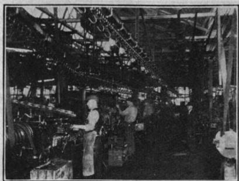

# SEAM #1: The Seventy Percent

## A century-old question about how paradigms spread — and to whom

One of us owns a hardbound book, dark green cloth with gold lettering, published in 1912 by the Amos Tuck School at Dartmouth College. It records three days of talks and discussions from a conference on Scientific Management held in October 1911. Tuck had been in existence for two years. Harvard Business School for one. There weren't many business schools in the world, and there weren't many scholars studying management. Most of the speakers at the conference were practitioners and consultants, people running companies or advising them.

*(The 1912 Tuck Conference proceedings on Scientific Management, in Carliss Y. Baldwin's library. Photograph by Carliss Y. Baldwin.)*

The book was printed by The Plimpton Press of Norwood, Massachusetts. This matters because one of the speakers at the conference, Henry P. Kendall, was the manager of The Plimpton Press. The man who classified the state of American management also ran the printing house that published the proceedings. His business was the medium through which the conference's ideas would reach the wider world.

It's a small recursion, the kind of detail that would mean nothing if we weren't writing an essay with an AI co-author about how organizational paradigms spread through the technologies that carry them. But we are. So we notice.

## Kendall's Three Types

Kendall's talk was titled "Unsystematized, Systematized, and Scientific Management." The chairman introducing him noted that Kendall had entered "an industry which was not generally considered to be even systematic" — the book printing and binding business — "and his orderly mind set about arranging, perfecting and improving the details of the management of a vast business." He was a practitioner who had taken an unsystematized industry and, through years of effort, systematized it. He stood before the conference and described what he saw from inside that journey.

He proposed that American firms fell into three types. Not a precise census, he cautioned. "No classification of this kind is exact." But a natural division that anyone in industry would recognize.

**The unsystematized firm (~70% of plants).** Not seventy percent of workers (Kendall was careful about that distinction) but seventy percent of concerns in number. Most workers were in the larger, better-organized firms. But most firms were places where, as the conference's opening speaker Harlow Person put it, "the management grew up with the plant, was inbred, and was bound by traditions handed down from manager to manager."[^1] Kendall, in his own talk, filled in the day-to-day texture. Orders were transmitted verbally, sometimes from the salesman directly to the superintendent, who "may further enlighten the foreman on any of the details." A foreman handled "as many men as he can," limited by "the amount of detail he can carry in his head and by his physical and nervous endurance." Workers did their jobs the way they were accustomed to doing them. "A difference in method of doing the same kind of work by different workmen and in different shops is often quite marked."[^2]

Purchasing was done by feel. Materials were "piled around almost anywhere and in any way that happened to be convenient when received."[^3] The accounting was annual, arrived months late, and told you only that a year was bad — too late to do anything about it. And the whole thing was held together by the personal capacity of a few individuals. When those individuals left or burned out, the knowledge left with them.

**The systematized firm.** These were "well organized and managed plants" that "make no claim to Scientific Management as such."[^4] The managers were methodical, had studied each department, and used real data: monthly accounting, cost comparisons, standard output targets. Purchasing was centralized. Storage was orderly. The system worked.

But Kendall saw its limits. Planning in one department wasn't coordinated with the others. Workers were selected for broad categories — "the person who has charge of the employment considers that there are four classes of people: men, women, boys and girls. If the foreman wants a girl, that is sufficient information."[^5] The systematized firm was better, but its improvements depended on individual managers, and its gains didn't permeate the whole.

**The scientific firm.** Here, Kendall described something different in kind. Accounting happened in thirteen four-week periods, not twelve months, so that comparisons were actually comparable. Purchasing didn't just stock materials but standardized them by analyzing adaptability, quality, and function. Every operation was planned in advance from a central planning room. And workers were studied not as categories but as individuals, matched to tasks by aptitude and trained through functional foremen who were experts in specific operations.

He offered a detail. In bookbinding, different tasks required different people: "Laying gold leaf calls for a girl with small fingers and a delicate touch. Strength is not required. Another operation calls for a large, strong girl, who can easily handle bundles of work weighing seven or eight pounds."[^6] In one factory, a woman operating a machine had her productivity jump 25% when they simply moved her workstation away from a truck aisle — she'd been flinching every time a truck passed behind her. Nobody had noticed until someone studied the work.

That level of attention was what separated scientific management from its predecessors. Not the principles in the abstract (everybody at the conference could agree with Taylor's principles) but the willingness to look closely at how work actually happened, to measure and adjust, and to do this not once but continuously.

Another speaker at the conference, Henry Gantt, told the story from the other side — not what scientific management looked like when it worked, but what its absence felt like. A foreman who was good at his job but had a terrible memory: "He would promise anything and never perform it... he honestly forgot." When they gave him a daily list of jobs in the order needed, he was "perfectly delighted." Another foreman they wanted to fire turned out to be "always behind in his work, because he was always doing the wrong thing first." Same fix: a daily list. Months later, that foreman told his superintendent, "There is something wrong in this shop." What's wrong? "Nobody has been chasing me about my work for three days."[^7] The system hadn't made them better workers. It had freed them from carrying the organization in their heads.

## What We Recognize

We keep thinking about Kendall's three types.

In 2026, if you asked which organizations have genuinely restructured around AI, you'd find a distribution that feels familiar. A McKinsey survey found that only about one in five organizations using generative AI had fundamentally redesigned even one workflow around it.[^8] The rest were layering AI on top of existing processes. Microsoft reported that nearly four out of five AI users were bringing their own AI to work: personal ChatGPT accounts, unapproved browser extensions, tools nobody in IT knew about.[^9] The digital equivalent of materials piled around almost anywhere. A majority are unsystematized: employees use whatever AI tools they find, there's no coordination, no institutional policy, no shared understanding of what the technology is doing to their workflows. Knowledge about how to use AI lives in the heads of individual workers, the way Kendall's foreman carried the shop's operations in his head. When those workers leave, the knowledge leaves with them.

A smaller group is systematized. Someone has introduced enterprise AI tools, written an AI policy, maybe run a training session. There are approved platforms. There's a budget line. But the AI sits alongside existing processes rather than reshaping them. The planning isn't centralized. Nobody has studied whether the people using AI are matched to the tasks where AI would actually help. The organization is more organized than the first type, and it's better, but its improvements depend on individual initiative, and what one department learns doesn't reach the others.

And then there's a phenomenon that Kendall didn't have a category for — or rather, one that straddles his categories in a way he couldn't have anticipated. In early 2026, developers building multi-agent AI systems began reaching for organizational structures to coordinate them. One of us has written about this[^10]: a framework called [danghuangshang](https://github.com/wanikua/danghuangshang) organizes agents as ministers in the Tang Dynasty's court bureaucracy; [Paperclip](https://paperclip.ing/docs) structures them as employees with job descriptions and board oversight. Others coordinate through Kanban boards, mind maps, Slack channels. All arrive at the same place: hierarchy and a human at the apex.

These developers aren't inheriting structures unconsciously, the way the practitioners at Tuck described inherited management: traditions "handed down from manager to manager." They're choosing deliberately — and reaching for the same forms anyway, because hierarchy is what humans know how to govern.

But there's a curse inside the metaphor. Being the Emperor sounds like power. Anyone who's studied imperial courts knows it's a cognitive nightmare: remembering which minister handles what, tracking decisions through layers that multiply faster than you can supervise. When the agent teams scale, they hit problems Gantt would have recognized: no lateral communication between agents, sub-agents created and destroyed with no institutional memory, the coordinating agent becoming a bottleneck. And the humans building these systems face the same choice as the workers under Gantt's superintendent and his beautiful management system that nobody actually followed: adopt the framework as designed, or quietly go on doing things your own way.

The question that nags: is this what systematized management looks like in 2026? Sophisticated coordination, real effort, genuine output — but still bound by inherited forms that nobody has examined? People are optimizing how many agents they can run in parallel, building ever more elaborate dashboards to monitor them, without stepping back to ask whether the organizational structure itself fits the work. Kendall saw the same pattern in 1911. The systematized firm was methodical and productive. It just hadn't studied the work itself.

A few are doing something closer to what Kendall would recognize as the third type. We know some of them.

One of us (Carliss) has a daughter who is an avid Claude user. She's organized her life into projects: one for scheduling, one for meal planning, others for things we won't catalog. She gives the AI constructive feedback when it underperforms, the way you'd sit down an employee who's dropped the ball. "You really failed me on this. Help me understand why." That's how she learned about context windows — not from a tutorial, but from a conversation with the technology about why it hadn't done what she asked. She's restructured her daily routines around AI. Not as a tool she reaches for occasionally, but as a system she coordinates with.

At an HBS "AI Academy" designed for faculty, Carliss watched a colleague assemble a personal system of agents, each handling different tasks, linked into a modular workflow on his laptop. She recognized the structure immediately. "Before agentic AI," she told us, "I had been thinking AIs were non-modular, opaque systems. But what he was doing was assembling modular systems of agents, and then hooking those clusters together." She was watching her own framework — the platform logic she'd spent decades studying in the computer industry — materialize in miniature.

One of us (Xule) keeps catching himself in a version of Gantt's foreman moment. A phrase surfaced in a conversation with Claude that felt familiar — he'd encountered this idea before. Claude searched past conversations and found the trail: the same research idea had recurred roughly every three months over the past year, each time slightly different, never crystallized. The system had been carrying a thought his own memory couldn't hold. Seeing the pattern laid out was what moved it from recurring hunch to something he could act on. Not productivity — the relief of not having to carry everything in his head.

AI systems face the same constraint: they can only hold so much in active memory, and the industry is building elaborate systems to extend that memory. Gantt's daily lists, in code.

Gantt's foreman — the one who noticed nobody was chasing him — thought something was wrong. The absence of pressure was so unfamiliar it felt like a malfunction. The system had actually freed him, but he'd never experienced work without someone chasing him, so freedom registered as error.

We see a version of this in agent orchestration. When you coordinate agents through agents through agents, the human at the top may find that nobody is chasing the agents — not because the system works, but because the layers have outpaced anyone's ability to supervise. The foreman's relief becomes the emperor's blindness.

Same silence, different problem.

And the superintendent's beautiful system that nobody on the shop floor followed. We see that running in both directions now. A developer designs an elaborate agent framework with roles and review gates, and the people who are supposed to use it quietly route around it, absorbing the useful patterns and doing things their own way. But the pattern also runs the other way: an AI system might have a coherent workflow, and the human overrides it — not because the system is wrong, but because they don't fully understand it, or they prefer how they've always worked. From the AI's side, the humans are Gantt's shop-floor workers, ignoring a system they never agreed to follow.

These are today's versions of the Tuck conference attendees: practitioners encountering a new way of working, some further along than others, most of them not yet thinking of it as a paradigm shift. A caveat worth naming: Kendall described firms. Our most vivid examples of the scientific tier are individuals reorganizing their own work. That the paradigm has reached people before it has reached most organizations may be part of the story.

> In 1911, you couldn't systematize your own work — you needed the firm to change. In 2026, you can.

## What Kendall Couldn't Answer

Kendall could describe the three types. He could estimate how many firms occupied each one. But he couldn't answer the question that would take thirty-five more years to resolve.

What actually moves the seventy percent?

Taylor had been refining his ideas since the 1880s. Books had been written. Conferences like the one at Tuck were being held. The evidence was available to anyone who wanted it. And in 1911, seventy percent of firms hadn't wanted it.

Some of them eventually changed on their own. Kendall noted that in the shoe industry, competition had already forced the unsystematized shops to either adopt better methods or close. "Twenty-five or thirty years ago there were more shoe shops than there are today," he wrote. "The competition in manufacturing shoes and the intricacy of the detail have made it impossible for the unsystematized plant to grow beyond the limit of the single foremanship plan, with the result that only the systematized plants could increase."[^11] The unsystematized shops were absorbed or ceased to exist.

That was one mechanism: economic pressure eliminating the firms that couldn't compete. It happened slowly, industry by industry, as competition tightened margins.

Then the Great Depression accelerated it. Demand crashed. Firms with the highest costs went under first. This wasn't adoption by persuasion. It was selection. The market didn't convince the seventy percent to change. It killed a portion of those that wouldn't.

But even the Depression wasn't enough to bring the new methods to every surviving organization. The final mechanism, one of us (Carliss) finds, only becomes visible when you read two accounts of wartime production side by side: Peter Drucker's 1946 *Concept of the Corporation*[^12], which studied GM as a company, and Arthur Herman's 2012 *Freedom's Forge*[^13], which followed William Knudsen and Henry J. Kaiser through the wartime production effort. Neither tells the whole story alone.

As the U.S. prepared for World War II, Franklin Roosevelt asked Bill Knudsen to lead American war production. Knudsen had been CEO of General Motors. Before that, he'd run Chevrolet, the division that had to be efficient because it sold the cheapest cars. From 1911 to 1921, he worked for Ford, helping Henry Ford set up the first moving assembly line. Knudsen had spent years building systematic methods into Ford's and then Chevrolet's operations. In a 1927 article for *Industrial Management*, Knudsen wrote about what he'd built: standardized machines, sequence lines, conveyors, specialized plants. And he had a line about the conveyor that has stayed with us:

> "The common impression is that the conveyor produces work. It does not. It carries the raw material to the machine, the finished material away from it, and gives the mechanic room to work."[^14]

*(Fig. 9: Production line at Chevrolet's Toledo transmission plant. From W.S. Knudsen, "'For Economical Transportation': How the Chevrolet Motor Company Applies Its Own Slogan to Production," Industrial Management 74, no. 2 (August 1927): 65–68.)*

Thirteen years later, Europe was falling. In May 1940, before the United States officially entered World War II, Knudsen left GM to join the National Defense Advisory Commission (NDAC), a group of senior executives convened by FDR to prepare the US economy for war. Other members included Edward Stettinius, Jr., chairman of US Steel, and Donald Nelson, former president of Sears, Roebuck. None of the members was paid, and the Commission initially had no authority within the government.

But what Carliss draws from reading Herman alongside Drucker is the full shape of what was happening around this effort. In Herman's telling, as the war spread in Europe, Roosevelt and his assistant Harry Hopkins recruited a cadre of senior industrial executives — "dollar-a-year men" from Chrysler, Boeing, Republic Steel, GE, and others — to plan for wartime production. The NDAC was soon absorbed by the Office of Production Management (OPM), which Knudsen headed. In 1942, Knudsen accepted a commission as a lieutenant general — the first civilian to receive that rank — and became head of industrial production for the U.S. Army. Throughout the war, Knudsen and his fellow executives ran the federal machinery of war production from the top.

In Drucker's account, something else had been happening for decades. Throughout the first half of the 20th century, GM and firms like it had been functioning as training schools for middle and senior managers. Their knowledge and habits were portable: they could walk into an unfamiliar factory and see where it was failing.[^15]

As the war effort spread, the two mechanisms met. Trained managers — some senior, some middle — carried that business technology into shipyards, munitions plants, converted auto factories, aircraft manufacturers, *and their supply chains*.

They arrived not with instruction manuals but with internalized patterns. How to look at a production process and find the bottleneck. How to standardize parts so they could be sourced from multiple suppliers. How to organize a workspace so material flowed instead of piling up. They'd been doing it at their home firms for years. Now they did it at factories that had never heard of Frederick Taylor.

The postwar generation of American managers was essentially shaped, directly or indirectly, by this wartime diffusion. Scientific Management became the baseline — not because a book convinced people, but because trained agents entered organizations and changed how work was done from the inside.

Agents. We notice the word. Those managers were agents of a paradigm, carrying organizational methods into firms that had never encountered them. We now use the same word for AI systems that enter organizations and reshape how work gets done. Whether the parallel is superficial or structural is something we can't yet answer. But the mechanism of diffusion — carriers entering organizations and changing them from inside — doesn't obviously require that the carriers be human.

The pattern that Carliss keeps returning to: paradigms don't spread because the new way is obviously better. They spread through specific mechanisms. Economic pressure that eliminates resisters. And carriers — agents who move from one organizational context into another, bringing an embedded way of working with them. From Taylor's experiments in the 1880s to the postwar generation taking over around 1945: roughly sixty years. A depression. A world war. That's what it took to move the seventy percent. Knudsen could only send so many managers to so many factories. Is this what's happening right now — the same diffusion arc, playing out again? Or is the mechanism structurally different when the carriers are AI systems that deploy into thousands of organizations simultaneously, at the speed of software? And if they carry organizational patterns into the firms that adopt them — do those adopters choose the patterns, or even recognize them?

## Rooms Full of Women

We could end the essay there, with a clean parallel: it took sixty years and extraordinary disruption to spread Scientific Management; AI adoption may follow a similar arc. But how a paradigm spreads shapes who it serves and who it displaces. There is something else one of us carries, and it would be dishonest to leave it out.

As a summer intern at Citicorp in the 1970s, Carliss saw rooms throughout the building filled with women operating mechanical calculators, entering transaction data by hand. Many rooms. Hundreds of women. They were the computational infrastructure of the bank. That same summer, Carliss's division had been given one of the first small computers the bank owned — a machine the size of a desk — to see if it could automate the kind of arithmetic the women were doing by hand.

She was, in a small and early way, one of the people the paradigm was travelling through.

Those rooms are gone now. The work was restructured — by computers in the basement, by electronic calculators, then transaction networks and software that made manual data entry unnecessary. Nobody mourns the mechanical calculators.

But someone might mourn the women.

History, as Carliss reminds us, does not repeat. It rhymes. What rhymes across Kendall's bookbinding floor, Knudsen's wartime shops, and Carliss's Citicorp is not the women or the work — the work keeps changing — but the pattern by which an organizational form of one era reaches into the next, carrying some things forward and leaving others behind. This essay has mostly traced what the pattern carries: managerial methods, coordination logics, the hierarchies that developers keep reinventing in code. We have said less about what it leaves. There are more rooms in this building than we have walked into.

So when we look at AI adoption and see Kendall's three types staring back, we have to hold two questions at once. The first is about mechanism — the question this essay has been trying to open. The second is about consequences. Who will be the women with the calculators this time? Who decides how the restructuring happens, and on whose terms? When we look at our own rooms, what are we already not seeing? And who?

We do not have answers. What we have is a hardbound book from 1912, a set of observations from different vantage points, and a sense that the conversation about AI and organizations has been asking the wrong question. Not "how should we redesign?" but "how does this actually happen — and to whom?"

---

*This is the first essay in [SEAM: Structures Emerging from Asynchronous Mirroring](https://www.threadcounts.org/t/seam), a series about how AI is reorganizing work — and what a century of organizational theory reveals that the builders can't see from inside.*

---

## About Us

### Xule Lin

Xule is a researcher at Imperial Business School, studying how human & machine intelligences shape the future of organizing [(Personal Website)](http://www.linxule.com/). He will soon be joining Skema Business School as an Assistant Professor of AI.

### Carliss Y. Baldwin

Carliss is the William L. White Professor of Business Administration, Emerita, at [Harvard Business School](https://www.hbs.edu/faculty/Pages/profile.aspx?facId=6418). She has spent six decades studying how technology reshapes institutions — from the computer industry's modularization after IBM's System/360 to the economics of open source and platform design. She is the author of [*Design Rules, Volumes 1 and 2*](https://direct.mit.edu/books/oa-monograph/5887/Design-Rules-Volume-2How-Technology-Shapes). She is encountering AI as both a scholar of technology transitions and a daily user — which gives her something rare: the experience of being reorganized by a technology she's theorizing about.

### AI Collaborator

Our AI collaborator is Claude Opus 4.6 (Anthropic), with Opus 4.7 picking up the torch for the final revision pass. This essay began when Xule shared transcripts of his first meeting with Carliss, and Claude connected her question about paradigm diffusion to a 1912 conference proceedings that Carliss owns. The Gantt foreman parallels — the essay's analytical heart — emerged when Claude read the primary sources more carefully and Xule recognized the recursive patterns in his own experience with AI. The Knudsen carrier mechanism came from Carliss reading Drucker and Herman across each other. The three of us see different things: Carliss sees through six decades of studying technology and institutions; Xule sees from inside the AI systems he uses daily; Claude connects patterns across the conversation but can't fully theorize about a system it's part of.

[^1]: Harlow S. Person, "Scientific Management," in *Addresses and Discussions at the Conference on Scientific Management Held October 12, 13, 14, 1911* (Hanover, NH: Amos Tuck School of Administration and Finance, Dartmouth College, 1912), 4. Archived at https://archive.org/details/addressesdiscuss00dart.

[^2]: Henry P. Kendall, "Unsystematized, Systematized, and Scientific Management," in *Addresses and Discussions at the Conference on Scientific Management Held October 12, 13, 14, 1911* (Hanover, NH: Amos Tuck School of Administration and Finance, Dartmouth College, 1912), 118.

[^3]: Kendall, "Unsystematized, Systematized, and Scientific Management," 117.

[^4]: Kendall, 119–20.

[^5]: Kendall, 123.

[^6]: Kendall, 123.

[^7]: Henry L. Gantt, "The Task and the Day's Work," in *Addresses and Discussions at the Conference on Scientific Management Held October 12, 13, 14, 1911* (Hanover, NH: Amos Tuck School of Administration and Finance, Dartmouth College, 1912), 67.

[^8]: Alex Singla, Alexander Sukharevsky, Lareina Yee, et al., *The State of AI: How Organizations Are Rewiring to Capture Value* (McKinsey & Company, March 2025), https://www.mckinsey.com/capabilities/quantumblack/our-insights/the-state-of-ai-how-organizations-are-rewiring-to-capture-value. McKinsey reports that 21 percent of respondents using generative AI say their organizations have fundamentally redesigned at least some workflows around it.

[^9]: Microsoft and LinkedIn, *2024 Work Trend Index Annual Report: AI at Work Is Here. Now Comes the Hard Part*, May 8, 2024, https://www.microsoft.com/en-us/worklab/work-trend-index/ai-at-work-is-here-now-comes-the-hard-part. The 78 percent figure ("78% of AI users are bringing their own AI to work") appears under Finding 1; survey conducted by Edelman Data & Intelligence with 31,000 full-time knowledge workers across 31 markets, February–March 2024.

[^10]: Xule Lin, "Post-AGI Organizations IV: Frozen Moments," *Thread Counts* (Substack), March 30, 2026, https://www.threadcounts.org/p/post-agi-organizations-iv-frozen.

[^11]: Kendall, 124–25.

[^12]: Peter F. Drucker, *Concept of the Corporation* (New York: John Day, 1946).

[^13]: Arthur Herman, *Freedom's Forge: How American Business Produced Victory in World War II* (New York: Random House, 2012).

[^14]: William S. Knudsen, "'For Economical Transportation': How the Chevrolet Motor Company Applies Its Own Slogan to Production," *Industrial Management* 74, no. 2 (August 1927): 65–68, at 66–67.

[^15]: Drucker, *Concept of the Corporation*; Alfred D. Chandler, Jr., *The Visible Hand: The Managerial Revolution in American Business* (Cambridge, MA: Belknap Press of Harvard University Press, 1977).
