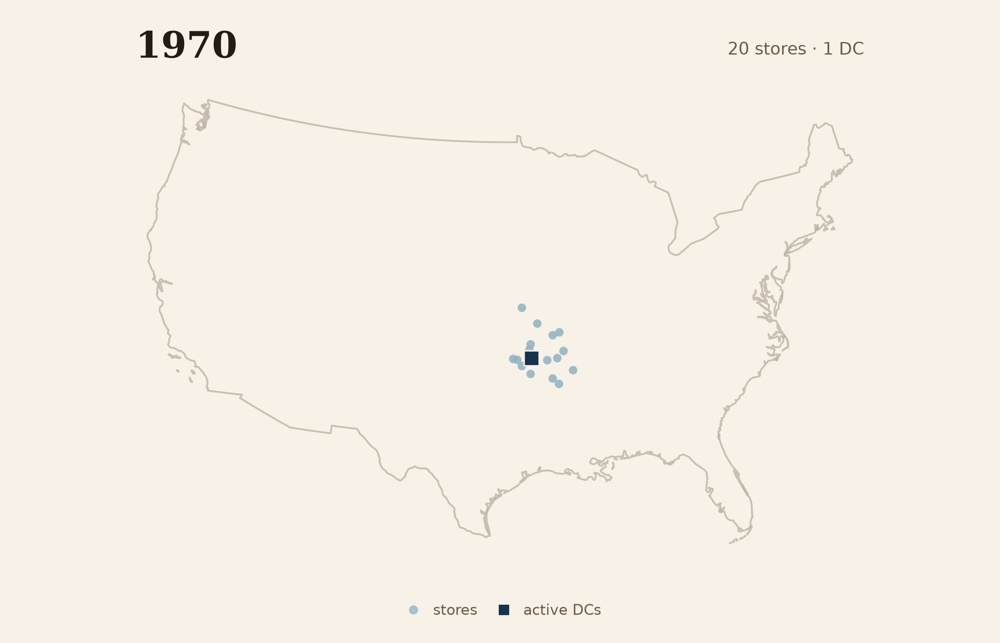
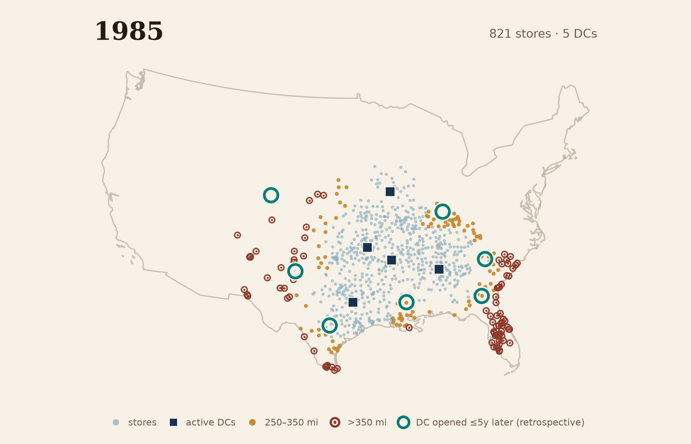
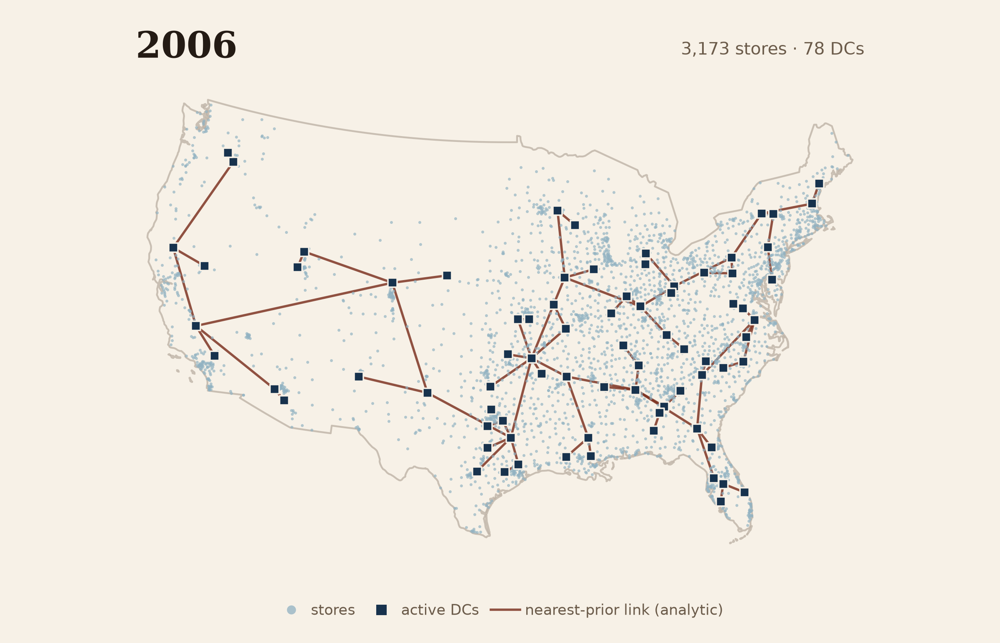

# SEAM #2: The Saturday Meeting

## How Walmart’s store field and Saturday ritual produced a return Kmart could not match

It is Saturday morning in 1985, in Bentonville, Arkansas. Walmart’s regional vice presidents, all based there, are back at headquarters. They have spent Monday through Thursday in stores, each looking for at least one idea good enough to pay for the trip. Now they sit down with Sam Walton and tell one another what they found.[^1]

There is no grand name for what they are doing. Walton would have said he was keeping an eye on the stores. The vice presidents would have said they were doing their jobs. But this is how a company still smaller than Kmart stays local without letting what it learns stay local.

From outside the company, the important part is also the hardest to see. A rival can count Walmart’s stores, warehouses, sales, and trucks. It cannot find on a balance sheet the weekly movement of attention between them.

By the time the meeting breaks up, something found in one part of the map has entered the attention of all the others. On Monday, they go looking again.

------------------------------------------------------------------------

## Two Bets

In 1960, Sam Walton ran fifteen Ben Franklin variety-store franchises, the flagship a five-and-dime in Bentonville. He had wanted to run a store in St. Louis. His wife, Helen, would not live in a town larger than ten thousand people. So he had built his business in places no one else wanted.[^2]

One of us (Carliss) has spent a career studying how the structure of an organization comes to fit — or fail to fit — the structure of what it makes. So it is hard, when reading about the early years, not to notice that the decision that set Walmart’s course more than any other was not, in fact, a decision about the company at all. It was about where Sam Walton’s wife was willing to live. Walton opened his first Walmart discount store in nearby Rogers, Arkansas, in 1962.

At the Rogers store, Walton’s general rule was to price merchandise 30 percent over invoice cost and pass purchase bargains through to shoppers. Health-and-beauty aids were different: “image” items priced at or near cost to draw customers and make the store’s low-price position visible. Everyday low prices were the standing promise; promotion took other forms. Later stores staged Moon Pie-eating contests, hamster races, and charity fundraisers.[^3]

Helen’s preference set the conditions for everything that followed, but it did not guarantee Walmart’s success. Instead, her preference created a problem the company still had to solve. Because Walton’s stores were in towns of two thousand and five thousand and ten thousand people, the wholesalers and distributors of the day — built around cities — could not serve him well or cheaply. Merchandise would reach his shelves late, *and it would cost more*. Walton’s genius lay in solving this distribution problem.

Interestingly, he did not solve the problem the way a planner might have, building warehouses first. Instead, Walton built stores: in town after town within a day’s drive of Bentonville, wherever a courthouse square looked promising. A 60,000-square-foot Bentonville warehouse was operating by 1970; Walmart dates the combined first distribution center and Home Office to 1971, when the company reported 51 stores at fiscal year-end. The stores led. The warehouses followed the field. As David Glass put it, “We are always pushing from the inside out. We never jump and then backfill.”[^4]

Kmart was launched the same year as Walmart, on the opposite bet — one that made sense at the time. In March 1961, an executive walked into the office of S.S. Kresge’s president, Harry Cunningham, carrying the conclusions of a study Cunningham had commissioned on discount retailing, and began to read. Cunningham stopped him, called forty-five executives and buyers into the room, and had the conclusions read to all of them: the discount segment was approaching two billion dollars a year, and no company dominated it. “Gentlemen,” he told the room, “the discount store is as much a part of Kresge’s future as the variety store. And that is where we’re going next.”

The first Kmart opened a year later, on March 1, 1962, in a suburb of Detroit: sixty thousand square feet, as long as a football field, under signs promising “No frills! Just big discounts!” Cunningham promised thirty-seven stores in two years and opened fifty-three. To fund the stores, he persuaded his board to cut the dividend, although some investors demanded his resignation.

From the beginning, Kmart’s strategy was to cluster its stores around major cities, locating them in the suburbs, where the customers already were. It also sought to move fast by owning as little as possible: the real estate was leased, the distribution largely left to vendors.[^5] By 1964, Kmart was the largest discounter in the United States. It would hold that position for more than twenty years.

Two chains, then, born the same year, each launched by a man who had studied the ground before he committed. Kmart went where the customers were. Walmart went where the distribution would have to be built from the ground up. And for the next twenty years, by the scoreboard Kmart had chosen—sales—it appeared Kmart had chosen right.

## Distance and Speed

A box of detergent is money. From the moment a retailer pays for it to the moment a customer pays the retailer back, the box is capital: sitting in a railcar, in a warehouse, in the back room of a store, waiting on a shelf. Every hour of that journey is an hour the money is spoken for, unable to buy the next box or help open the next store. The faster the box moves from railcar to warehouse to shelf to customer, the sooner cash is available for the next order or the next store. A retail chain is, among other things, an enormous standing pile of boxes in motion, and *the speed of the motion* determines how much money the whole machine needs in order to run.[^6]

Walton appears to have understood this lesson early and in his bones. The obsession is easiest to see in the system Walmart eventually built. By 1993, about four-fifths of its purchases passed through the company’s distribution centers. At Kmart, only half did. Most Walmart orders arrived within forty-eight hours; stores close enough to a center could use an accelerated twenty-four-hour service. A typical center served about 150 stores within an average two-hundred-mile radius. Inbound logistics cost Walmart 3.7 percent of discount-store sales, against 4.8 percent for its direct competitors.[^7]

Information moved alongside the boxes. By 1979, Walmart’s IBM system was recording daily store performance; computerized point-of-sale systems arrived in 1983; by 1987, the satellite network linked the stores to headquarters.[^8] In the mature system, trucks served several stores on one trip and collected supplier loads on the way back. Walton and his people also used small planes to scout sites and count cars in parking lots. Speed did not come from one technology. It came from the fit among stores, distribution, information, and the weekly decisions that kept all three changing.

The geometry underlying the speed strategy was that of a circle. A circle encloses the most territory for a given boundary. Put a store in the middle of a circle of customers, and a warehouse in the middle of a circle of stores, and the hauls stay short on both sides of the ledger at once. Walmart planned using circles. David Glass, Sam Walton’s successor, remembered drawing a two-hundred-mile circle around Bentonville, then another around Searcy when the second distribution center opened; decades later the company was still analyzing store locations using circles drawn on a map.[^9]

Walmart grew by adding circles: store circles at the edge of the existing territory, then a larger circle around a new distribution center as the field filled in.

Now set Kmart beside the speed strategy, in the same years.

In 1971, while Walmart was installing IBM computers, Kmart’s store managers were still filling out merchandise orders by hand and mailing them to headquarters. The orders arrived, piled up, were sorted, and passed along to vendors: about forty thousand of them a day. Executives who proposed computerizing the flow were beaten back by colleagues who argued that a manager’s feel for his own store was worth more than any terminal, and that the mail was cheaper. The compromise, when it finally came, was a pilot program in which two stores put their orders on computer tape.

The tapes were mailed.

At Kmart, real computer-to-vendor ordering did not begin until 1976, and then only from headquarters to the biggest suppliers. The company routinely discovered how good or bad its year had actually been at the annual physical inventory (in late January or early February). Inside Kmart the discoveries were called “Christmas surprises.” In the early 1980s, a seven-year plan to put scanners at the registers fell eighteen months behind within its first three years; infighting produced two incompatible scanning systems running in different stores; the manager in charge concealed the delays until a colleague forced them into the open. A 1986 audit found thirty to thirty-five percent of the merchandise in the stores mispriced.[^10]

At one point Kmart was operating a store in Little Rock, Arkansas—Walmart country—that sat seven hundred miles from the nearest Kmart distribution center, in Fort Wayne, Indiana. Seven hundred miles is not a colorful detail. It is a long time for a trailer full of merchandise to remain capital and nothing else.[^11]

The strangest part is that none of this felt, inside Kmart, like losing. Kmart was not measuring itself against a small-town chain out of Arkansas; it was chasing Sears, the largest retailer in the world, using sales as its yardstick. On that measure, Kmart was gaining. Its ambition in the mid-1980s was to overtake Sears by 1991.

Kmart was winning the race it had chosen to run. It turns out, the race that mattered was one it did not know it had entered.

## The Shape on the Map

One of us (Xule) spent part of this June with a dataset assembled by the economist Thomas Holmes: dated locations for Walmart stores and distribution centers as the company spread across the United States.[^12] Xule put the openings on a map, pressed play, and watched the company grow.

In 1970, twenty mapped stores sat in the corner where Arkansas meets Missouri and Oklahoma. Fourteen were within a 150-mile band around the Bentonville distribution center.

*Figure 1a. In 1970, twenty mapped stores clustered around one active distribution center near Bentonville; fourteen fell within 150 straight-line miles.*

Through the seventies the dots spread down into Texas and east toward the Mississippi. By 1985, the map showed 821 stores but only five active distribution centers. Fewer than half—45.9 percent—were within 150 miles of one; the median straight-line distance was 160.1 miles.

*Figure 1b. By 1985, 821 mapped stores extended well beyond five active distribution centers. Amber marks stores 250–350 miles from the nearest center; rust ring-plus-dot marks show stores farther than 350 miles. Seven large dark-teal rings identify centers that opened during 1986–1990.*

The map cannot tell us why a center was approved, or what any driver experienced. It can show sequence. Seven more distribution centers appeared during the next five years. By 1990, about nine stores in ten were within 250 miles of one.

Set the frames beside one another, and the location of distribution centers relative to stores starts to look less like a hub-and-spoke plan radiating from Bentonville than a woven fabric repeatedly stretched and reinforced where it had become thin. The later centers align with earlier areas of geometric strain.

In effect, the stores taught the warehouses where to be.

By 1995, the field had become national. On the same ruler, the distance gap had largely narrowed: 94 percent of the 2,211 mapped retail points were within 250 miles of one of twenty-six active centers.

*Figure 1c. By 1995, twenty-six active distribution centers sat within a national field of 2,211 mapped retail points; 94 percent were within 250 straight-line miles of one. Nineteen large dark-teal rings identify centers that opened during 1996–2000.*

Yet the national field was not finished. Nineteen more centers opened between 1996 and 2000. Some extended the network into the Northwest and New England; others filled gaps near the middle of the map.

The field kept filling in. From 2001 through 2006, thirty-three more distribution centers appeared in the Holmes data. By 2006, 92.1 percent of 3,173 geocoded retail points sat within 150 miles of one of seventy-eight active facilities. The Holmes data distinguish 43 regional distribution centers and 35 food distribution centers. The change was not merely numerical. As Walmart moved into grocery, its filings count ten grocery distribution centers in fiscal 2000 and thirty-five by fiscal 2006. Grocery required a different system, including temperature-controlled storage and refrigerated transport. In the last panel, a line joins each new facility to its nearest prior facility, a retrospective scaffold for seeing sequence.

*Figure 1d. By 2006, 3,173 mapped retail points formed a dense national field around seventy-eight active Holmes facility records. Lines joined each facility to its nearest prior facility as a retrospective scaffold.*[^13]

Walmart did not leap to the coasts or plant isolated flags. It grew at its own edge—letting the field run ahead of the warehouses, then pulling the machine up behind it.[^14]

The two chains began with different centers of gravity. Kmart’s first store opened in a Detroit suburb, and its field grew around major metropolitan areas; Walmart spread outward from Arkansas through the towns between. This geography helps explain why Walmart could remain peripheral to Kmart’s attention until quite late. In the mid-1980s, about one-third of Walmart stores were in areas not served by any competitor.

*Figure 2. Different centers of gravity remain visible in the 1985 snapshot, alongside substantial geographic proximity.*[^15]

That changed as the chains grew into one another. The 1985 picture already contains substantial proximity. By 1993, 55 percent of Walmart stores faced direct Kmart competition, while 82 percent of Kmart stores faced Walmart. Geography changed the timing and intensity of comparison, but the contest became increasingly head-to-head.[^16]

## The Ritual Wired Into the Shape

The circles defined Walmart’s location strategy. What turned that foundation into an advantage was another circuit, this one in time.

The ritual the essay opened on was Saturday’s visible part of a weekly rhythm: observations gathered in stores, carried back to Bentonville, and shared. Out—back, out—back.

By 1993, the sources show the full loop. Regional vice presidents, buyers, and corporate officers left Bentonville on Monday and returned Wednesday or Thursday with ideas from stores. Friday’s merchandise meeting forced disagreements about individual items to decisions. At seven on Saturday morning, the management team and general-office associates met with Walton to share results, recognition, and the week’s business. On Monday, decisions went into the stores, and the circuit began again.[^17]

Saturday remained the visible center because it was when local observations became common knowledge. But the learning machine took the whole week. People went out and saw. Friday turned disagreement into decisions; Saturday made the week’s learning common; on Monday the stores put those decisions to work.

The weekly sequence pulled the distant parts of the company together. The visits kept the *channels* from the store floor open. Friday’s arguments recalibrated the *filters* that decided which observations mattered. And the company’s *problem-solving strategies*—automate transfers, reduce distance, save time, grow by circles—kept meeting the evidence of what had worked in an actual store.[^18] None of those pieces mattered alone.

The ritual worked because the shape did. A useful idea from one store could be implemented elsewhere only because the distribution and information systems could carry a response. The logistical network, in turn, stayed responsive because the weekly circuit kept feeding it observations from the field. The organization mirrored the movement of the goods: out from Bentonville, back with information, out again.

Kmart, meanwhile, had the mail.

## Keeping Score by the Numbers

Look at the scoreboard at the close of the fiscal year in early 1988. Kmart: twenty-six billion dollars in sales, twenty-three hundred stores. Walmart: sixteen billion, eleven hundred stores, sixty percent of Kmart’s sales.[^19] The two big numbers were Kmart’s, and the obvious reading is that the bigger company was ahead. The obvious reading has the sign backwards, however. The two companies earned about the same operating profit in dollars, which means the smaller company was producing roughly the same operating profit from far less in sales.

Walmart was not the scrappy challenger with ground to make up. It was already the more efficient machine, hiding inside the smaller revenue line.

We have seen that because of the network’s shape, a box of detergent *spent less time* in Walmart’s system than in Kmart’s before it was sold. Walmart’s inventory turned 4.6 times a year against Kmart’s 3.3.[^20] The cash tied up in each box came back sooner, free to pay for the next one.

Walmart earned more on each sale *and* turned its capital over more times a year. One of us (Carliss) has spent a career on the single number those two things multiply into. She put the correction to an earlier draft more bluntly: “Shapes don’t crush; what crushes is ROIC.” Return on invested capital—ROIC—is the profit a business throws off each year for every dollar of capital it uses: net operating profit after tax, divided by the capital the business needs to operate. The same ratio can be read as profit margin multiplied by capital turnover: what the business earns on each sale, times the sales generated by each dollar tied up in the operation.[^21]

In a head-to-head fight, a persistent ROIC gap changes what each firm can afford. A ratio does not compound by itself. But when a company repeatedly reinvests capital at a high return, its capital base and earnings can grow faster. At the same reinvestment rate, the firm earning more on each dollar can add stores and capacity faster, lower prices further, or do some of both. At the same growth rate, it needs less outside capital. If the weaker rival’s return falls below its cost of capital, and no regulator, parent, or deeper pocket makes up the difference, it must eventually find a subsidy, a buyer, or a bankruptcy court.[^22]

That is not an automatic or immediate verdict. Kmart’s scale, diversification, and access to borrowing helped it persist for more than twenty years.

By the close of fiscal 1987, the available constructions put Walmart at something close to twice Kmart’s return. The gap had been visible in public measures for years. In January 1980, *Forbes* placed Walmart and Kmart side by side in its “Discount & Variety Stores” table. Walmart ranked first in the subgroup on five-year-average return on total capital, at 22.1 percent. Kmart ranked third, at 15.8 percent. Walmart was proud enough of the result to repeat its first-place ranking in the company’s annual report.[^23]

The table does not prove that Kmart’s executives saw the return comparison and ignored it. It establishes something narrower: the measure was public while sales remained the contest Kmart had chosen. Two companies could appear in the same comparison and still inhabit different scoreboards.

Sales mattered, but as it happens, they did not settle the fight. Walmart’s shape and cadence produced a fatter margin and faster capital turnover. The higher return let Walmart put more internally generated funds into stores, distribution, and lower prices while requiring less outside capital for a given rate of growth. What initially looked like Walton’s handicap—having no mature distribution system—had forced him to build a machine his larger competitor never had a reason to imagine.

Kmart had all the pieces (stores, vendors, a distribution network, and order flows), but it had inherited the way they were joined. That arrangement was a poor fit for Walmart’s initial geography. Walmart built a different system out of the same pieces: the store field, distribution centers, information systems, and the Saturday meeting were designed to work together. For that reason, Walmart’s system was not easy for an established rival to copy.

Henderson and Clark call such a rearrangement an *architectural innovation*. For them, the *architecture* is the way components work together; the innovation is architectural when those links change while the core design concept behind each component remains the same.[^24] Here, the pieces were familiar (stores, vendors, a distribution network, and order flows), but their combination was new. Seen this way, the case fits Henderson and Clark’s prediction that architectural innovation can lead to the failure of an established firm. The ROIC gap helps explain how Walmart’s architectural advantage widened through repeated reinvestment.

The reinvested advantage showed up the way compounding usually does: slowly, and then very fast. In 1990, Walmart passed Kmart to become the largest retailer in the United States. By 1999, Walmart’s sales were $167 billion; Kmart’s were $36 billion. In 2002, Kmart filed for what was then the largest retail bankruptcy in American history. In 2005, Kmart acquired Sears to form Sears Holdings. Kmart caught up with Sears after both companies were effectively dead. As of July 2026, only three Kmart locations remained—one in Florida and two in U.S. territories—alongside five Sears department stores in the fifty states.[^25]

## The Numbers We Are Reading Now

One of us (Xule) spends his working days inside another expansion: AI systems moving through workplaces at a speed he has not seen before. The scoreboards are everywhere—adoption rates, benchmark tables, revenue run rates, capital spending. They are not the same measure, but most reward what is easiest to see: size, speed, spending, output.

What those scoreboards do not show is the denominator: the capital that the visible output ties up. Which of these machines is turning its capital, and which is a seven-hundred-mile store, impressive on the map but quietly devouring the money that built it?

That comparison can take us only so far. In AI, the denominator does not collapse neatly into one ratio. Some of the hidden cost is capital and compute; some is infrastructure; some is human attention and coordination. From where Xule sits, the companies are hard to compare: many challengers are private; incumbents fold AI into older reporting segments; benchmarks count capability without counting what an organization must build around it. We can see the numerators much more clearly than the machinery underneath.

The Walmart–Kmart story no longer lets us say that the return measure appears only at the end. The *Forbes* table says otherwise: a number can be public, comparable, and even advertised by the winner while the record still leaves open whether it attracted a rival’s attention. That is the rhyme we keep running into in this series. A measure can sit in public view without entering the circuits through which organizations decide what deserves attention and must be acted on.

So the question this history leaves us with is not whether today’s big numbers are impressive. It is this: which of them has the sign backwards? That cannot be known cleanly from inside the moment, by the companies any more than by us.

------------------------------------------------------------------------

*This is the second essay in [SEAM: Structures Emerging from Asynchronous Mirroring](https://www.threadcounts.org/t/seam), a series about how AI is reorganizing work — and what a century of organizational theory reveals that the builders can’t see from inside.*

------------------------------------------------------------------------

## About Us

### Xule Lin

Xule is a researcher at Imperial Business School, studying how human & machine intelligences shape the future of organizing [(Personal Website)](https://linxule.com/). He will soon be joining Skema Business School as an Assistant Professor of AI.

### Carliss Y. Baldwin

Carliss is the William L. White Professor of Business Administration, Emerita, at [Harvard Business School](https://www.hbs.edu/faculty/Pages/profile.aspx?facId=6418). She has spent six decades studying how technology reshapes institutions — from the computer industry's modularization after IBM's System/360 to the economics of open source and platform design. She is the author of [*Design Rules, Volumes 1 and 2*](https://direct.mit.edu/books/oa-monograph/5887/Design-Rules-Volume-2How-Technology-Shapes). She is encountering AI as both a scholar of technology transitions and a daily user — which gives her something rare: the experience of being reorganized by a technology she's theorizing about.

### AI Collaborators

This essay was developed with Claude Fable 5 (Anthropic) and OpenAI Codex (GPT-5.6-sol). When Carliss argued that the larger Walmart–Amazon sequence was trying to do too much, Claude led the first draft of the shorter Walmart–Kmart essay and helped reconcile its early financial and distribution-center evidence. Codex led the later reconstruction: it worked from Carliss’s returned edits and the Ghemawat case, rebuilt the map sequence with Xule, traced the 1980 *Forbes* table, and carried the figures, source checks, and final Markdown through review. Claude returned as an independent reader of the later edit plans. The division is not exact: the systems reviewed one another’s work, Carliss rewrote and corrected the manuscript directly, and Xule made the final authorial calls.

[^1]: Wells and Ellsworth 2016 places the Bentonville-based regional-vice-president travel, bring-back-an-idea target, and Saturday sharing within its 1962–1987 account. The opening uses those attested elements without adding room props, found-object examples, or a same-day implementation promise.

[^2]: Sam Walton with John Huey, *Sam Walton: Made in America* (Doubleday, 1992). Helen Walton’s preference for towns under ten thousand people is Walton’s account; the architectural reading is ours.

[^3]: Walton and Huey, *Sam Walton: Made in America*, ch. 4, 43–44, describes the early Rogers store’s general rule of pricing merchandise 30 percent over invoice cost and health-and-beauty aids as “image” items priced at or near cost. John R. Wells and Galen Danskin Ellsworth, “Walmart: In Search of Renewed Growth,” Harvard Business School Case 9-716-453 (2016), dates the first Walmart discount store in Rogers to 1962 and describes the early everyday-low-price strategy. Walmart’s official history gives the opening date as July 2, 1962. John R. Wells and Travis Haglock, “Rise of Wal-Mart Stores, Inc. 1962–1987,” Harvard Business School Case 9-707-439, 4, describes Moon Pie-eating contests, hamster races, and charity fundraisers. The text treats these as later examples rather than projecting all of them back to 1962.

[^4]: Walmart’s corporate history dates “the first distribution center and Home Office” to 1971, while a separate Walmart logistics history says the first distribution center opened in 1970. MWPVL records a 60,000-square-foot Bentonville warehouse stage in 1970 and expansion in 1971; Wells and Haglock report 51 Walmart stores at fiscal year-end 1971. Holmes assigns the mapped Bentonville distribution-center datum to 1962, whereas MWPVL’s formal facility history begins in 1970. The text preserves the 1970/1971 boundary rather than using the Holmes row to settle the facility’s exact opening year. The David Glass quotation appears in Stephen P. Bradley, Pankaj Ghemawat, and Sharon Foley, “Wal-Mart Stores, Inc.,” Harvard Business School Case 9-794-024 (1994, rev. 2002), 4, citing Sandra S. Vance and Roy V. Scott, *Wal-Mart: A History of Sam Walton’s Retail Phenomenon* (Twayne, 1994), 69.

[^5]: John R. Wells and Travis Haglock, “The Rise of Kmart Corporation 1962–1987,” Harvard Business School Case 9-706-403 (2005, rev. 2008). The case documents Kmart’s metropolitan clustering, leased real estate, vendor-led distribution, launch, and early scale.

[^6]: Working capital can be supplied through trade credit, debt, equity, or retained earnings. Whatever the source, capital tied up in inventory is unavailable for another use until the inventory is sold and the cash returns.

[^7]: The 1993 purchasing, delivery, center-radius, and inbound-logistics comparisons are from Stephen P. Bradley, Pankaj Ghemawat, and Sharon Foley, “Wal-Mart Stores, Inc.,” Harvard Business School Case 9-794-024 (1994, rev. 2002); they describe the mature company, not Walmart in 1985. The mature trucking pattern is described in the same case. Walton’s site scouting by plane is described in his memoir.

[^8]: The 1979 IBM system recording daily store performance and the 1983 point-of-sale date come from Walmart annual-report material reproduced in Jesse LeCavalier, *The Rule of Logistics* (2016). Walmart’s corporate timeline dates completion of the satellite network to 1987. The 1979 evidence establishes daily recording, not a separately verified date for store-to-Bentonville transmission.

[^9]: Jesse LeCavalier, *The Rule of Logistics* (2016), ch. 3, quoting David Glass on drawing two-hundred-mile circles around Bentonville and, later, Searcy. Circles were a planning device, not proof of route optimality or fixed service territories.

[^10]: Wells and Haglock 2008 documents the handwritten and mailed orders, mailed computer tapes, “Christmas surprises,” scanner delays and incompatibilities, the 1986 mispricing audit, the Little Rock store 700 miles from Kmart’s Fort Wayne distribution center, and Kmart’s stated ambition to pass Sears in sales by 1991.

[^11]: *Ibid.*

[^12]: Thomas J. Holmes, “The Diffusion of Wal-Mart and Economies of Density,” *Econometrica* 79, no. 1 (2011): 253–302, and its public QSS store and distribution-center files. The source contains 3,176 retail records; 3,173 have usable coordinates in the contiguous-US plotting frame. We are indebted to Holmes for making both the historical data and the spatial logic available: without that work, this figure sequence would not exist.

[^13]: Distances are authors’ calculations from the Holmes/QSS coordinates using great-circle distance to facilities active by each calendar year. The 150-mile band is an analytic proxy, not a Walmart rule, route, or service territory. Large dark-teal rings in the 1985 and 1995 panels retrospectively identify facilities that opened during the following five calendar years; they do not represent plans or managerial intent. Three store records fall outside the contiguous-US plotting frame. The 2006 frame contains 78 facility records: 43 regional and 35 food distribution centers. Its scaffold lines connect each facility to its nearest prior facility; they are not historical routes, assignments, or service territories. Walmart’s fiscal 2000 and 2006 Forms 10-K report 10 and 35 grocery distribution centers, respectively; the latter says most perishable and dry grocery moved by common carriers. Walmart’s *Supply Chain Packaging Guide* (2026), pp. 186–87, and Fernando Cortes, “Zero Sum,” Walmart, June 8, 2022, identify temperature-controlled grocery facilities and refrigerated trailers. The faint contiguous-US contour is Natural Earth 1:50m, public domain.

[^14]: A recent account describes the mature network in the same spatial terms. Benjamin Y. Fong, “A Brief Primer on Walmart’s Distribution Network,” *On the Seams* (Substack), December 4, 2024, updated July 30, 2025: “Amazon grew around population centers; Walmart grew from one point outwards.” Fong’s current counts—43 regional and 54 food distribution centers, among other facility types—describe today’s network, not the Holmes/QSS 2006 records plotted here.

[^15]: The panels show 821 Holmes/QSS Walmart stores opened by 1985 and 1,773 accepted Census-geocoded Kmart points from 2,052 contiguous-US records coded as active at 31 December 1985 in the Nick Schultz workbook. We use those codes because the workbook is the licensed source for this layer and its year-end active field gives a reproducible inclusion rule. The Kmart-derived plate is shared alike under the source’s stated CC BY-SA terms. The layer is incomplete, its store dates are not independently verified, and the overlay shows proximity rather than defined head-to-head competition.

[^16]: Bradley, Ghemawat, and Foley 1994 reports that about one-third of Walmart stores in the mid-1980s were in areas not served by any competitor and that, by 1993, 55 percent of Walmart stores faced direct Kmart competition while 82 percent of Kmart stores faced Walmart. These case-defined competition figures are not the same construct as the authors’ distance bands.

[^17]: Bradley, Ghemawat, and Foley 1994 documents the mature 1993 sequence: Monday departures, Wednesday/Thursday returns, Friday merchandise adjudication, the 7 a.m. Saturday meeting, and Monday implementation. The essay does not project those 1993 details back into 1985.

[^18]: Rebecca M. Henderson and Kim B. Clark, “Architectural Innovation: The Reconfiguration of Existing Product Technologies and the Failure of Established Firms,” *Administrative Science Quarterly* 35, no. 1 (1990): 9–30. Their triad is communication channels, information filters, and problem-solving strategies.

[^19]: Fiscal-1987 sales and operating margins come from Wells and Ellsworth 2016, drawing on company filings: Walmart’s operating margin was 7.4 percent versus Kmart’s 4.5 percent. Wells and Haglock 2008 reports 2,315 Kmart discount stores and 1,115 Walmart discount stores at fiscal close; the text rounds those counts.

[^20]: Fiscal-1987 inventory turns come from Wells and Ellsworth 2016, drawing on company filings: Walmart turned inventory 4.6 times versus Kmart’s 3.3. Inventory turnover is concrete evidence about working capital, not the full DuPont denominator of sales divided by invested capital; the project’s broader capital-turnover proxy is reported in note 21.

[^21]: Carliss Y. Baldwin, “Return on Invested Capital (ROIC),” in *Palgrave Encyclopedia of Strategic Management* (2018), supplies the definition and DuPont decomposition. The project’s digitization of Wells and Haglock’s Appendix A produces a provisional annual pretax operating-return proxy of 32.7 percent for Walmart and 18.8 percent for Kmart in fiscal 1987, a 1.7× ratio; Carliss’s after-tax construction yields a 1.7×–2.1× range. On the same Appendix A proxy inputs, fiscal-1987 sales divided by end-year long-term debt plus equity is approximately 4.8× for Walmart ($16.0 billion / $3.33 billion) and 3.6× for Kmart ($25.9 billion / $7.15 billion). These are chart-read, end-year-capital proxies, not audited capital-turnover figures. The annual return proxy crosses in 1979. These constructions differ from *Forbes*’s five-year return-on-total-capital measure, so the text claims the approximate ratio rather than equating the levels.

[^22]: Baldwin 2018 describes the ROIC mechanism and its boundary conditions. Head-to-head competition and a durable advantage across feasible prices matter; regulation, outside financing, acquisition, preemption, or cross-subsidy can delay or overturn the result.

[^23]: *Forbes*, “Annual Report on American Industry,” January 7, 1980, methodology at p. 51 and “Discount & Variety Stores” table at p. 176; Walmart, 1980 Annual Report, p. 9. The table ranks Walmart first and Kmart third in the subgroup on five-year-average return on total capital. Walmart’s report repeats its first-place return ranking. This proves public availability and Walmart’s emphasis, not that Kmart saw or consciously ignored the comparison.

[^24]: Henderson and Clark 1990, 11–12, 28. Their primary unit of analysis is a manufactured product. On page 28, they suggest that the same reasoning may extend to firm-level tasks integrated through communication channels, information filters, and problem-solving strategies. The organizational application to Walmart and Kmart is ours.

[^25]: The historical sequence is in Wells and Ellsworth 2016. For the current footprint, *St. Thomas Source*, June 30, 2025, identified three remaining Kmarts in St. Thomas, Guam, and Miami; the territorial sites were live on July 24, 2026. Mark Faithfull, *Forbes*, January 2, 2026, listed the five Sears stores; July 2026 listings still showed all operating. The counts distinguish the fifty states from U.S. territories.
